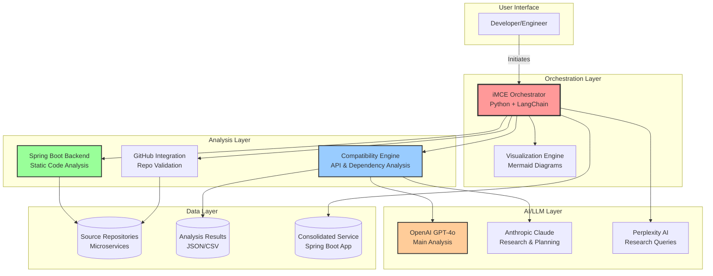
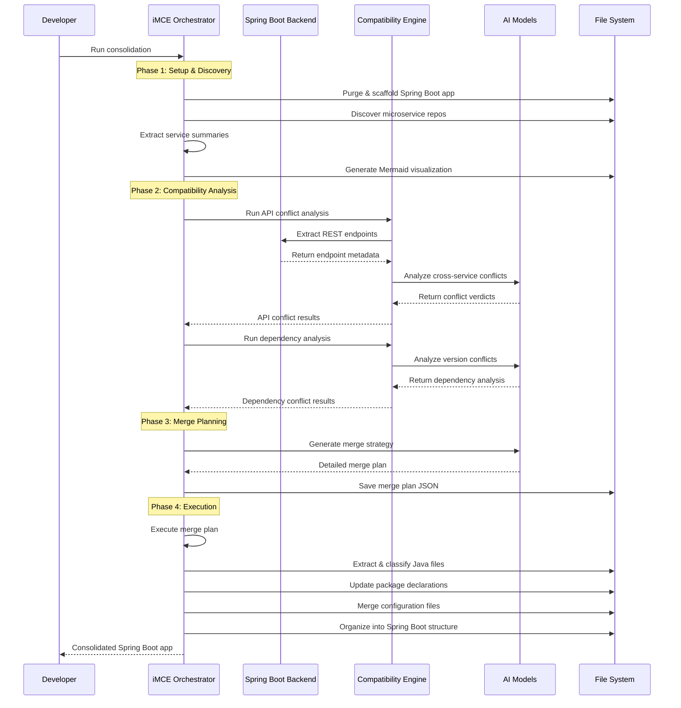
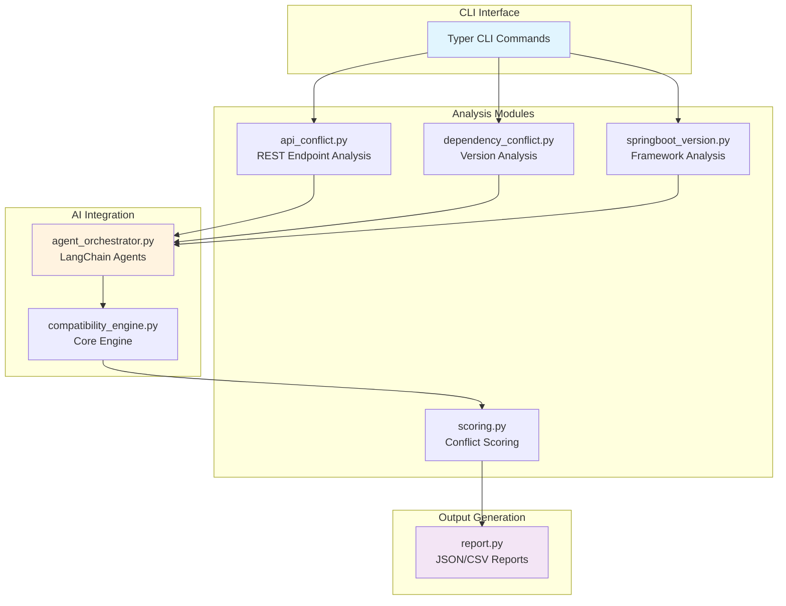

# Microservice Consolidation Platform - Detailed Design

This document provides a comprehensive technical design overview of the Microservice Consolidation Platform, including architecture diagrams, data flow, and implementation details.

## 🏗️ System Overview

The Microservice Consolidation Platform is an AI-powered system that automates the analysis, planning, and execution of microservice consolidation. It combines static code analysis, intelligent conflict detection, and automated merge execution to transform multiple microservices into a unified Spring Boot application.

## 🎯 Core Components

### 1. **iMCE (intelligent Microservice Consolidation Engine)**
- **Purpose**: Main orchestrator that coordinates the entire consolidation pipeline
- **Technology**: Python + LangChain + OpenAI/Anthropic APIs
- **Location**: `iMCE/consolidation_orchestrator.py`

### 2. **Compatibility Engine**
- **Purpose**: AI-powered analysis of API and dependency conflicts
- **Technology**: Python + LangChain + Typer CLI
- **Location**: `compatibility-engine/`

### 3. **Spring Boot Backend**
- **Purpose**: Static code analysis and metadata extraction
- **Technology**: Java 21 + Spring Boot + Gradle
- **Location**: `springboot-backend/`

### 4. **GitHub Integration**
- **Purpose**: Repository validation and metadata extraction
- **Technology**: Python + GitHub API
- **Location**: `github-integration/`

---

## 🔄 High-Level Architecture



---

## 🔀 Detailed Data Flow



---

## 🧩 Component Deep Dive

### iMCE Orchestrator Architecture

```mermaid
graph LR
    subgraph "iMCE Core Functions"
        INIT[purge_and_scaffold<br/>Spring Initializr API]
        DISC[find_microservice_repos<br/>Repository Discovery]
        SUM[extract_service_summary<br/>Metadata Extraction]
        VIZ[generate_mermaid<br/>Visualization]
    end
    
    subgraph "Compatibility Pipeline"
        API[run_compatibility_engine<br/>API Analysis]
        DEP[dependency_analysis<br/>Version Conflicts]
        LOAD[load_compatibility_results<br/>JSON Processing]
    end
    
    subgraph "AI Planning"
        PLAN[generate_merge_plan<br/>LLM Strategy]
        SUM_COMPAT[summarize_compatibility<br/>Token Management]
    end
    
    subgraph "Execution Engine"
        EXEC[execute_merge_plan<br/>File Operations]
        CLASS[classify_java_file<br/>Pattern Recognition]
        MERGE[merge_properties_files<br/>Configuration]
    end
    
    INIT --> DISC
    DISC --> SUM
    SUM --> VIZ
    VIZ --> API
    API --> DEP
    DEP --> LOAD
    LOAD --> SUM_COMPAT
    SUM_COMPAT --> PLAN
    PLAN --> EXEC
    EXEC --> CLASS
    EXEC --> MERGE
    
    style INIT fill:#ffeb3b
    style EXEC fill:#4caf50
    style PLAN fill:#2196f3
    style API fill:#ff9800
```



### Compatibility Engine Architecture



### Java File Classification System

```mermaid
flowchart TD
    START([Java File Input]) --> READ[Read File Content]
    READ --> PARSE[Parse Annotations & Filename]
    
    PARSE --> MAIN{@SpringBootApplication?}
    MAIN -->|Yes| SKIP[Skip - Already Have Main]
    MAIN -->|No| CTRL{@Controller or @RestController?}
    
    CTRL -->|Yes| CONTROLLER[controller/ package]
    CTRL -->|No| SERV{@Service or 'service' in name?}
    
    SERV -->|Yes| SERVICE[service/ package]
    SERV -->|No| REPO{@Repository or 'dao' in name?}
    
    REPO -->|Yes| REPOSITORY[repository/ package]
    REPO -->|No| ENT{@Entity or 'model' in name?}
    
    ENT -->|Yes| MODEL[model/ package]
    ENT -->|No| CONF{@Configuration or 'config' in name?}
    
    CONF -->|Yes| CONFIG[config/ package]
    CONF -->|No| DTO{'dto' or 'request' in name?}
    
    DTO -->|Yes| DTO_PKG[dto/ package]
    DTO -->|No| EXC{'exception' or 'error' in name?}
    
    EXC -->|Yes| EXCEPTION[exception/ package]
    EXC -->|No| UTIL{'util' or 'helper' in name?}
    
    UTIL -->|Yes| UTILITY[util/ package]
    UTIL -->|No| TEST{'test' in name?}
    
    TEST -->|Yes| TEST_PKG[test/ package]
    TEST -->|No| OTHER[other/ package]
    
    CONTROLLER --> UPDATE[Update Package Declaration]
    SERVICE --> UPDATE
    REPOSITORY --> UPDATE
    MODEL --> UPDATE
    CONFIG --> UPDATE
    DTO_PKG --> UPDATE
    EXCEPTION --> UPDATE
    UTILITY --> UPDATE
    TEST_PKG --> UPDATE
    OTHER --> UPDATE
    SKIP --> END([Complete])
    UPDATE --> END
    
    style START fill:#e8f5e8
    style END fill:#ffe8e8
    style UPDATE fill:#e8e8ff
```

---

## 📊 Data Models

### API Conflict Analysis Result
```json
{
  "service1": "user-service",
  "service2": "auth-service",
  "endpoint1": {
    "path": "/api/users/{id}",
    "method": "GET",
    "params": ["id"],
    "returns": "UserDTO"
  },
  "endpoint2": {
    "path": "/api/users/{userId}",
    "method": "GET", 
    "params": ["userId"],
    "returns": "User"
  },
  "conflictType": "PARAMETER_MISMATCH",
  "severity": "MEDIUM",
  "reasoning": "Both endpoints serve user data but use different parameter names (id vs userId) and return types (UserDTO vs User)",
  "recommendation": "Standardize parameter naming and create unified UserDTO"
}
```

### Merge Plan Structure
```json
{
  "plan": [
    {
      "step": 1,
      "action": "MERGE_CONTROLLERS",
      "description": "Consolidate UserController and AuthController",
      "files": ["UserController.java", "AuthController.java"],
      "target": "com.imce.app.controller.UserManagementController"
    },
    {
      "step": 2,
      "action": "RESOLVE_DEPENDENCIES",
      "description": "Update Spring Boot to 3.4.0, align Jackson versions",
      "dependencies": {
        "spring-boot": "3.4.0",
        "jackson": "2.15.2"
      }
    }
  ],
  "summary": "Consolidate 6 microservices into unified Spring Boot application",
  "estimatedComplexity": "HIGH",
  "riskFactors": ["version conflicts", "duplicate endpoints"]
}
```

### Service Summary Model
```json
{
  "name": "user-service",
  "path": "repos/spring-boot-microservices/user-webservice",
  "type": "Spring Boot",
  "endpoints": [
    {
      "path": "/api/users",
      "method": "GET",
      "controller": "UserController"
    }
  ],
  "dependencies": {
    "spring-boot": "2.7.0",
    "spring-data-jpa": "2.7.0"
  },
  "configFiles": ["application.properties"],
  "port": 8080
}
```

---

## 🔄 Processing Pipeline Details

### Phase 1: Discovery & Setup
1. **Repository Scanning**: Discover all microservice directories in `repos/`
2. **Spring Boot Scaffolding**: Use Spring Initializr API to create clean base application
3. **Service Profiling**: Extract metadata, endpoints, dependencies from each service
4. **Visualization**: Generate Mermaid diagrams showing current architecture

### Phase 2: Compatibility Analysis
1. **Endpoint Extraction**: Java static analysis to find all REST endpoints
2. **Cross-Service Pairing**: Generate all possible endpoint combinations
3. **AI Conflict Analysis**: LLM-powered reasoning about conflicts
4. **Dependency Analysis**: Version conflict detection and resolution planning

### Phase 3: Merge Strategy Planning
1. **Conflict Summarization**: Reduce token count for LLM processing
2. **Strategy Generation**: AI-powered merge planning with step-by-step actions
3. **Risk Assessment**: Identify potential issues and mitigation strategies

### Phase 4: Execution
1. **File Classification**: Intelligent categorization of Java files
2. **Package Restructuring**: Update package declarations to unified structure
3. **Resource Merging**: Combine configuration files intelligently
4. **Spring Boot Assembly**: Create proper Spring Boot application structure

---

## 🧪 Testing Strategy

### Unit Tests
- **Java Backend**: JUnit tests for static analysis components
- **Python Modules**: pytest for compatibility engine and orchestrator
- **File Classification**: Test classification algorithm with sample files

### Integration Tests
- **End-to-End Pipeline**: Test complete consolidation flow
- **API Compatibility**: Validate conflict detection accuracy
- **Merge Execution**: Verify output application structure

### AI Model Testing
- **Prompt Engineering**: Test LLM responses with various conflict scenarios
- **Token Management**: Validate summarization maintains key information
- **Reasoning Quality**: Manual review of AI conflict analysis

---

## 🚀 Performance Considerations

### Optimization Strategies
1. **Parallel Processing**: Concurrent analysis of multiple microservices
2. **Caching**: Store analysis results to avoid re-computation
3. **Token Management**: Smart summarization to stay within LLM limits
4. **Filtering**: Only analyze same HTTP method combinations for API conflicts

### Scalability
- **Horizontal Scaling**: Support for analyzing larger microservice ecosystems
- **Incremental Analysis**: Analyze only changed services in subsequent runs
- **Result Persistence**: Store and reuse compatibility analysis results

---

## 🔮 Future Enhancements

### Planned Features
1. **Interactive Conflict Resolution**: Web UI for manual conflict resolution
2. **Advanced Merge Strategies**: More sophisticated consolidation algorithms
3. **Multi-Language Support**: Extend beyond Spring Boot to other frameworks
4. **Continuous Integration**: GitHub Actions integration for automated analysis
5. **Migration Assistance**: Generate migration guides and documentation

### AI Model Improvements
1. **Custom Training**: Fine-tune models on microservice-specific data
2. **Multi-Model Ensemble**: Combine multiple AI models for better accuracy
3. **Feedback Learning**: Incorporate user feedback to improve recommendations

---

## 📚 Technology Stack Summary

| Component | Technology | Purpose |
|-----------|------------|---------|
| **Orchestrator** | Python + LangChain | Main coordination and AI integration |
| **Static Analysis** | Java 21 + Spring Boot | Code parsing and metadata extraction |
| **Compatibility Engine** | Python + Typer | Conflict detection and analysis |
| **AI/LLM** | OpenAI GPT-4o, Anthropic Claude | Intelligent reasoning and planning |
| **Research** | Perplexity AI | Real-time information gathering |
| **Visualization** | Mermaid.js | Architecture diagrams |
| **Build System** | Gradle, npm | Java and Node.js build automation |
| **Version Control** | Git + GitHub | Source code management |

This design provides a comprehensive foundation for the Microservice Consolidation Platform, enabling intelligent, automated consolidation of complex microservice architectures into unified Spring Boot applications. 