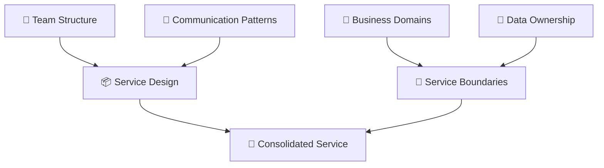
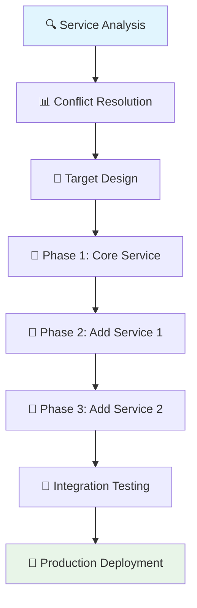

# 🚀 Manual Microservice Consolidation 
## 📋 Standard Operating Procedure

<div align="center">


</div>

---

> 🎯 **Mission**: Transform multiple microservices into a unified, maintainable Spring Boot application while preserving functionality and improving performance.

---

## 📚 Table of Contents

| 🔗 Phase | 📖 Chapter | ⏱️ Duration | 🎯 Objective |
|-----------|-------------|-------------|--------------|
| 🔧 | [1. Introduction & Theory](#-1-introduction--theory) | 30 min | Understand the fundamentals |
| 🛠️ | [2. Prerequisites & Preparation](#-2-prerequisites--preparation) | 1 hour | Setup and validation |
| 🔍 | [3. Environment Setup & Discovery](#-3-phase-1-environment-setup--discovery) | 2-4 hours | Analyze existing services |
| ⚖️ | [4. Compatibility Analysis](#-4-phase-2-compatibility-analysis) | 4-6 hours | Identify conflicts |
| 📋 | [5. Merge Strategy Planning](#-5-phase-3-merge-strategy-planning) | 2-3 hours | Create execution plan |
| 🔀 | [6. Code Consolidation](#-6-phase-4-code-consolidation) | 1-2 days | Merge codebases |
| ⚙️ | [7. Configuration Management](#-7-phase-5-configuration-management) | 4-6 hours | Unified configuration |
| 🧪 | [8. Testing & Validation](#-8-phase-6-testing--validation) | 1-2 days | Comprehensive testing |
| ✅ | [9. Quality Assurance](#-9-phase-7-quality-assurance) | 4-6 hours | Final validation |
| 🛠️ | [10. Troubleshooting Guide](#-10-troubleshooting-guide) | Reference | Problem resolution |
| 💡 | [11. Best Practices & Tips](#-11-best-practices--tips) | Reference | Expert guidance |
| 📋 | [12. Final Checklist](#-12-final-checklist) | 1 hour | Pre-deployment validation |

---

> 💡 **Pro Tip**: This document will guide you through the complete manual process of consolidating multiple microservices into a single Spring Boot application. Each phase builds upon the previous one, so follow the sequence carefully.

---

## 🎯 1. Introduction & Theory

### 🤔 What is Microservice Consolidation?

Microservice consolidation is the strategic process of combining multiple independent microservices into fewer, more cohesive services or a single monolithic application. This approach reverses the typical microservices decomposition pattern.

### 🎯 When Should You Consolidate?

| 🚨 Problem | 📊 Impact | 🎯 Solution |
|------------|-----------|------------|
| **Over-decomposition** | Too many fine-grained services | Merge related capabilities |
| **Operational Complexity** | High management overhead | Reduce service count |
| **Performance Issues** | Network latency problems | Eliminate inter-service calls |
| **Team Restructuring** | Misaligned ownership | Realign service boundaries |
| **Cost Optimization** | Infrastructure overhead | Reduce deployment complexity |

### 🏗️ Theoretical Foundation

#### 🔄 Conway's Law and Service Boundaries

> 📖 **Conway's Law**: "Organizations design systems that mirror their communication structure."

When consolidating microservices, consider:



### 🎯 Consolidation Benefits

| ✅ Benefit | 📈 Impact | 💰 Value |
|------------|-----------|----------|
| **Reduced Complexity** | Fewer moving parts | Lower operational costs |
| **Improved Performance** | Eliminated network calls | Better user experience |
| **Simplified Deployment** | Single deployment unit | Faster releases |
| **Better Data Consistency** | Local transactions | Reduced data issues |
| **Enhanced Development Speed** | Unified codebase | Faster feature delivery |

---

## 🛠️ 2. Prerequisites & Preparation

### 📋 Essential Skills Checklist

| ✅ Skill | 🎯 Level | 📚 Resources |
|----------|----------|--------------|
| **Spring Boot 3.x** | Intermediate+ | [Spring Docs](https://spring.io/projects/spring-boot) |
| **Java 21** | Intermediate+ | [Java 21 Features](https://openjdk.org/projects/jdk/21/) |
| **Gradle/Maven** | Intermediate | [Build Tools Guide](https://gradle.org/guides/) |
| **Database Design** | Intermediate | [Database Patterns](https://martinfowler.com/eaaCatalog/) |
| **REST API Design** | Advanced | [REST Best Practices](https://restfulapi.net/) |
| **Git/Version Control** | Intermediate+ | [Git Workflows](https://www.atlassian.com/git/tutorials/comparing-workflows) |

### 🛠️ Technology Stack

> 🎯 **Target Architecture**: Spring Boot 3.4.0 + Java 21 + PostgreSQL

| 🔧 Component | 📦 Technology | 🎯 Version |
|--------------|---------------|------------|
| **Framework** | Spring Boot | 3.4.0+ |
| **Language** | Java | 21 |
| **Build Tool** | Gradle | 8.0+ |
| **Database** | PostgreSQL | 15+ |
| **Testing** | JUnit + TestContainers | 5.x |
| **Security** | Spring Security | 6.x |

### 🔧 Development Environment Setup

#### 📦 Required Software Installation

```bash
# ☕ Java 21 Installation (macOS with Homebrew)
brew install openjdk@21

# 🐘 PostgreSQL Installation
brew install postgresql@15
brew services start postgresql@15

# 🔧 Gradle Installation
brew install gradle

# 🐳 Docker (for TestContainers)
brew install docker
```

#### ✅ Environment Validation

```bash
# 🧪 Verify installations
echo "☕ Java Version:"
java -version

echo "🐘 PostgreSQL Status:"
pg_ctl -D /usr/local/var/postgres status

echo "🔧 Gradle Version:"
gradle --version

echo "🐳 Docker Status:"
docker --version
```

### 📁 Project Structure Setup

```bash
# 🏗️ Create workspace directory
mkdir microservice-consolidation
cd microservice-consolidation

# 📂 Initialize directory structure
mkdir -p {source-services,consolidated-service,analysis,scripts,docs}

# 📋 Create tracking files
touch analysis/services-inventory.md
touch analysis/conflicts-log.md
touch docs/migration-plan.md
```

---

## 🔍 3. Phase 1: Environment Setup & Discovery

> 🎯 **Objective**: Catalog all existing microservices and understand their architecture, dependencies, and integrations.

### 📊 Step 1: Service Discovery & Inventory

#### 🔍 Service Catalog Template

Create `analysis/services-inventory.md`:

| 🏷️ Service | 🚀 Technology | 📦 Version | 🌐 Endpoints | 💾 Database | 🔗 Dependencies |
|-------------|---------------|------------|--------------|-------------|-----------------|
| user-service | Spring Boot | 2.7.x | `/api/users/*` | MySQL | auth-service |
| order-service | Spring Boot | 3.0.x | `/api/orders/*` | PostgreSQL | user-service, inventory |
| inventory-service | Spring Boot | 2.6.x | `/api/inventory/*` | MySQL | - |

#### 🔍 Automated Discovery Script

```bash
#!/bin/bash
# scripts/discover-services.sh

echo "🔍 === MICROSERVICE DISCOVERY REPORT ==="
echo "📅 Generated: $(date)"
echo ""

# 🔍 Find all Spring Boot applications
echo "🚀 === SPRING BOOT SERVICES ==="
find . -name "pom.xml" -o -name "build.gradle" | while read buildfile; do
    dir=$(dirname "$buildfile")
    echo "📦 Found build file: $buildfile"
    
    # 🔍 Extract service info
    if [[ "$buildfile" == *"pom.xml" ]]; then
        echo "  🛠️  Build Tool: Maven"
        artifactId=$(grep -m1 "<artifactId>" "$buildfile" | sed 's/.*<artifactId>\(.*\)<\/artifactId>.*/\1/')
        echo "  🏷️  Artifact: $artifactId"
    else
        echo "  🛠️  Build Tool: Gradle"
        # Extract from settings.gradle or build.gradle
        if [[ -f "$dir/settings.gradle" ]]; then
            rootProject=$(grep "rootProject.name" "$dir/settings.gradle" | cut -d"'" -f2)
            echo "  🏷️  Project: $rootProject"
        fi
    fi
    
    # 🔍 Check for Spring Boot
    if grep -q "spring-boot" "$buildfile"; then
        echo "  ✅ Spring Boot detected"
        
        # 🔍 Find application.properties/yml
        if [[ -f "$dir/src/main/resources/application.properties" ]]; then
            echo "  ⚙️  Config: application.properties"
            port=$(grep "server.port" "$dir/src/main/resources/application.properties" | cut -d'=' -f2)
            [[ -n "$port" ]] && echo "  🌐 Port: $port"
        fi
        
        if [[ -f "$dir/src/main/resources/application.yml" ]]; then
            echo "  ⚙️  Config: application.yml"
        fi
        
        # 🔍 Find REST controllers
        controller_count=$(find "$dir/src" -name "*.java" -exec grep -l "@RestController\|@Controller" {} \; | wc -l)
        echo "  🎮 Controllers: $controller_count"
        
        # 🔍 Find entities
        entity_count=$(find "$dir/src" -name "*.java" -exec grep -l "@Entity" {} \; | wc -l)
        echo "  💾 Entities: $entity_count"
    fi
    echo ""
done

echo "🔍 === DISCOVERY COMPLETE ==="
```

### 📊 Step 2: API Endpoint Analysis

#### 🌐 REST Endpoint Discovery

```bash
#!/bin/bash
# scripts/analyze-endpoints.sh

echo "🌐 === API ENDPOINT ANALYSIS ==="

# 🔍 Find all REST controllers
find . -name "*.java" -exec grep -l "@RestController\|@Controller" {} \; | while read controller; do
    echo "🎮 Controller: $controller"
    
    # 🔍 Extract class-level RequestMapping
    class_mapping=$(grep -o "@RequestMapping([^)]*)" "$controller" | head -1)
    echo "  🏷️  Base Path: $class_mapping"
    
    # 🔍 Extract method mappings
    grep -n "@\(Get\|Post\|Put\|Delete\|Patch\)Mapping\|@RequestMapping" "$controller" | while read mapping; do
        line_num=$(echo "$mapping" | cut -d: -f1)
        mapping_content=$(echo "$mapping" | cut -d: -f2-)
        echo "    📍 Line $line_num: $mapping_content"
    done
    echo ""
done
```

### 💾 Step 3: Database Schema Analysis

#### 🗄️ Database Discovery Script

```bash
#!/bin/bash
# scripts/analyze-databases.sh

echo "💾 === DATABASE SCHEMA ANALYSIS ==="

# 🔍 Find JPA entities
find . -name "*.java" -exec grep -l "@Entity" {} \; | while read entity; do
    echo "📊 Entity: $entity"
    
    # 🔍 Extract table name
    table_name=$(grep -o "@Table(name.*)" "$entity" | sed 's/@Table(name[[:space:]]*=[[:space:]]*"\([^"]*\)".*/\1/')
    if [[ -n "$table_name" ]]; then
        echo "  🏷️  Table: $table_name"
    else
        # 🔍 Use class name as table name
        class_name=$(basename "$entity" .java)
        echo "  🏷️  Table: $class_name (inferred)"
    fi
    
    # 🔍 Extract primary key
    grep -n "@Id\|@GeneratedValue" "$entity" | while read pk_line; do
        echo "    🔑 Primary Key: Line $(echo $pk_line | cut -d: -f1)"
    done
    
    # 🔍 Extract relationships
    grep -n "@OneToMany\|@ManyToOne\|@OneToOne\|@ManyToMany" "$entity" | while read rel; do
        echo "    🔗 Relationship: Line $(echo $rel | cut -d: -f1)"
    done
    echo ""
done
```

### 🔍 Step 4: Dependency Analysis

#### 📦 Dependency Matrix Creation

```bash
#!/bin/bash
# scripts/analyze-dependencies.sh

echo "📦 === DEPENDENCY ANALYSIS ==="

# 🔍 Create dependency matrix
echo "| Service | Spring Boot | Spring Version | Database | Security | Other |"
echo "|---------|-------------|----------------|----------|----------|-------|"

find . -name "pom.xml" -o -name "build.gradle" | while read buildfile; do
    dir=$(dirname "$buildfile")
    service_name=$(basename "$dir")
    
    # 🔍 Extract Spring Boot version
    if [[ "$buildfile" == *"pom.xml" ]]; then
        spring_boot_version=$(grep -A1 "spring-boot-starter-parent" "$buildfile" | grep "<version>" | sed 's/.*<version>\(.*\)<\/version>.*/\1/')
        db_deps=$(grep "mysql\|postgresql\|h2" "$buildfile" | wc -l)
        security_deps=$(grep "spring-security" "$buildfile" | wc -l)
    else
        spring_boot_version=$(grep "org.springframework.boot" "$buildfile" | grep -o "version '[^']*'" | head -1)
        db_deps=$(grep -c "mysql\|postgresql\|h2" "$buildfile")
        security_deps=$(grep -c "spring-security" "$buildfile")
    fi
    
    echo "| $service_name | $spring_boot_version | - | $db_deps DB deps | $security_deps Security | - |"
done
```

---

## ⚖️ 4. Phase 2: Compatibility Analysis

> 🎯 **Objective**: Identify conflicts in APIs, dependencies, and configurations that need resolution during consolidation.

### 🚨 Step 1: API Conflict Detection

#### 🔍 Automated Conflict Analysis

```python
#!/usr/bin/env python3
# scripts/api_conflict_analyzer.py

import os
import re
import json
from collections import defaultdict

class APIConflictAnalyzer:
    def __init__(self):
        self.endpoints = defaultdict(list)
        self.conflicts = []
    
    def analyze_controller(self, file_path):
        """🔍 Analyze a Java controller file for REST endpoints"""
        with open(file_path, 'r') as f:
            content = f.read()
        
        # 🔍 Extract class-level RequestMapping
        class_mapping = re.search(r'@RequestMapping\([^)]*"([^"]*)"', content)
        base_path = class_mapping.group(1) if class_mapping else ""
        
        # 🔍 Extract method mappings
        method_patterns = [
            r'@GetMapping\([^)]*"([^"]*)"',
            r'@PostMapping\([^)]*"([^"]*)"',
            r'@PutMapping\([^)]*"([^"]*)"',
            r'@DeleteMapping\([^)]*"([^"]*)"',
            r'@PatchMapping\([^)]*"([^"]*)"'
        ]
        
        for pattern in method_patterns:
            matches = re.finditer(pattern, content)
            for match in matches:
                endpoint = base_path + match.group(1)
                method = pattern.split('Mapping')[0][1:]  # Extract HTTP method
                
                self.endpoints[endpoint].append({
                    'method': method,
                    'file': file_path,
                    'service': self._extract_service_name(file_path)
                })
    
    def _extract_service_name(self, file_path):
        """🏷️ Extract service name from file path"""
        parts = file_path.split(os.sep)
        for i, part in enumerate(parts):
            if 'src' in part and i > 0:
                return parts[i-1]
        return 'unknown'
    
    def find_conflicts(self):
        """⚠️ Identify API endpoint conflicts"""
        for endpoint, implementations in self.endpoints.items():
            if len(implementations) > 1:
                # 🚨 Check for same method conflicts
                methods = defaultdict(list)
                for impl in implementations:
                    methods[impl['method']].append(impl)
                
                for method, impls in methods.items():
                    if len(impls) > 1:
                        self.conflicts.append({
                            'type': 'API_CONFLICT',
                            'endpoint': endpoint,
                            'method': method,
                            'implementations': impls,
                            'severity': 'HIGH'
                        })
    
    def generate_report(self):
        """📊 Generate conflict analysis report"""
        return {
            'total_endpoints': len(self.endpoints),
            'total_conflicts': len(self.conflicts),
            'conflicts': self.conflicts,
            'endpoint_summary': dict(self.endpoints)
        }

# 🚀 Main execution
if __name__ == "__main__":
    analyzer = APIConflictAnalyzer()
    
    # 🔍 Find all Java controller files
    for root, dirs, files in os.walk('.'):
        for file in files:
            if file.endswith('.java'):
                file_path = os.path.join(root, file)
                with open(file_path, 'r') as f:
                    content = f.read()
                    if '@RestController' in content or '@Controller' in content:
                        analyzer.analyze_controller(file_path)
    
    # 🔍 Analyze conflicts
    analyzer.find_conflicts()
    
    # 📊 Generate report
    report = analyzer.generate_report()
    
    # 💾 Save results
    with open('analysis/api_conflicts.json', 'w') as f:
        json.dump(report, f, indent=2)
    
    # 📄 Print summary
    print("🌐 === API CONFLICT ANALYSIS RESULTS ===")
    print(f"📊 Total Endpoints: {report['total_endpoints']}")
    print(f"⚠️  Total Conflicts: {report['total_conflicts']}")
    
    if report['conflicts']:
        print("\n🚨 CONFLICTS DETECTED:")
        for conflict in report['conflicts']:
            print(f"  ❌ {conflict['method']} {conflict['endpoint']}")
            for impl in conflict['implementations']:
                print(f"    📂 {impl['service']}: {impl['file']}")
    else:
        print("✅ No API conflicts detected!")
```

### 📊 Step 2: Dependency Conflict Analysis

#### 🔍 Dependency Version Matrix

```bash
#!/bin/bash
# scripts/dependency-conflicts.sh

echo "📦 === DEPENDENCY CONFLICT ANALYSIS ==="

# 🎯 Common Spring Boot dependencies to check
dependencies=(
    "spring-boot-starter-web"
    "spring-boot-starter-data-jpa"
    "spring-boot-starter-security"
    "spring-boot-starter-actuator"
    "spring-boot-starter-test"
)

echo "| 📦 Dependency | 🚀 Service | 🏷️ Version | ⚠️ Conflict Level |"
echo "|---------------|------------|------------|-------------------|"

for dep in "${dependencies[@]}"; do
    echo "🔍 Analyzing: $dep"
    
    # 🔍 Find all build files mentioning this dependency
    grep -r "$dep" --include="pom.xml" --include="build.gradle" . | while read match; do
        file=$(echo "$match" | cut -d: -f1)
        service=$(dirname "$file" | xargs basename)
        
        # 🔍 Extract version (simplified)
        if [[ "$file" == *"pom.xml" ]]; then
            version=$(grep -A2 -B2 "$dep" "$file" | grep "<version>" | sed 's/.*<version>\(.*\)<\/version>.*/\1/' | head -1)
        else
            version=$(echo "$match" | grep -o ":[0-9][^'\"]*" | head -1)
        fi
        
        [[ -z "$version" ]] && version="inherited"
        echo "| $dep | $service | $version | ⚠️ TBD |"
    done
done
```

### 🗄️ Step 3: Database Schema Conflicts

#### 🔍 Schema Compatibility Analysis

```sql
-- scripts/schema-analysis.sql
-- 🗄️ Database Schema Conflict Analysis

-- 📊 Table analysis template
SELECT 
    'users' as table_name,
    CASE 
        WHEN EXISTS (SELECT 1 FROM information_schema.tables WHERE table_name = 'users') 
        THEN '✅ Exists' 
        ELSE '❌ Missing' 
    END as status,
    (SELECT COUNT(*) FROM information_schema.columns WHERE table_name = 'users') as column_count,
    CASE 
        WHEN EXISTS (SELECT 1 FROM information_schema.columns WHERE table_name = 'users' AND column_name = 'id' AND data_type = 'bigint')
        THEN '✅ Compatible PK'
        ELSE '⚠️ Check PK'
    END as primary_key_status;

-- 🔍 Generate schema comparison script
-- Run this against each service's database
\copy (
    SELECT 
        table_name,
        column_name,
        data_type,
        is_nullable,
        column_default
    FROM information_schema.columns 
    WHERE table_schema = 'public'
    ORDER BY table_name, ordinal_position
) TO 'analysis/service_schema.csv' CSV HEADER;
```

---

## 📋 5. Phase 3: Merge Strategy Planning

> 🎯 **Objective**: Create a detailed, step-by-step plan for consolidating services while minimizing risks and conflicts.

### 🎯 Step 1: Consolidation Strategy Selection

#### 📊 Strategy Comparison Matrix

| 🎯 Strategy | ⏱️ Timeline | 🎛️ Complexity | 📉 Risk Level | 💰 Cost | 🎯 Best For |
|-------------|-------------|---------------|---------------|---------|-------------|
| **🔄 Big Bang** | 1-2 weeks | 🔴 High | 🔴 High | 💰 Low | Small services |
| **🎯 Incremental** | 4-6 weeks | 🟡 Medium | 🟢 Low | 💰💰 Medium | Medium services |
| **🔄 Strangler Fig** | 8-12 weeks | 🟡 Medium | 🟢 Low | 💰💰💰 High | Large services |
| **📦 Database First** | 2-4 weeks | 🟢 Low | 🟡 Medium | 💰💰 Medium | Data-heavy services |

#### 🎯 Recommended Approach: **Incremental Migration**



### 📋 Step 2: Service Prioritization Matrix

#### 🎯 Migration Order Analysis

```bash
#!/bin/bash
# scripts/service-prioritization.sh

echo "🎯 === SERVICE MIGRATION PRIORITY ANALYSIS ==="

# 📊 Create prioritization matrix
cat > analysis/service-priority.md << 'EOF'
# 🎯 Service Migration Priority Matrix

| 🏷️ Service | 🔗 Dependencies | 📊 Complexity | 🚨 Risk | 🎯 Priority | 📅 Order |
|-------------|-----------------|---------------|---------|-------------|----------|
| user-service | None | Low | Low | 🟢 High | 1st |
| inventory-service | user-service | Medium | Medium | 🟡 Medium | 2nd |
| order-service | user, inventory | High | High | 🔴 Low | 3rd |

## 🎯 Migration Strategy

### 🟢 Phase 1: Foundation (user-service)
- ✅ No external dependencies
- ✅ Clean database schema  
- ✅ Well-defined APIs
- ✅ Comprehensive tests

### 🟡 Phase 2: Core Business (inventory-service)  
- ⚠️ Depends on user-service
- ✅ Moderate complexity
- ⚠️ Some API overlaps

### 🔴 Phase 3: Complex Integration (order-service)
- ❌ Multiple dependencies
- ❌ Complex business logic
- ❌ Cross-service transactions
EOF

echo "📊 Priority analysis saved to: analysis/service-priority.md"
```

### 🏗️ Step 3: Target Architecture Design

#### 🎯 Consolidated Service Blueprint

```java
// 🏗️ Target Package Structure
com.consolidated.app/
├── 🎮 controller/          // REST endpoints
│   ├── UserController.java
│   ├── OrderController.java
│   └── InventoryController.java
├── 🔧 service/             // Business logic
│   ├── UserService.java
│   ├── OrderService.java
│   └── InventoryService.java
├── 🗄️ repository/          // Data access
│   ├── UserRepository.java
│   ├── OrderRepository.java
│   └── ProductRepository.java
├── 📊 model/               // Domain entities
│   ├── User.java
│   ├── Order.java
│   └── Product.java
├── 🔄 dto/                 // Data transfer objects
│   ├── UserDTO.java
│   ├── OrderDTO.java
│   └── ProductDTO.java
├── ⚙️ config/              // Configuration
│   ├── DatabaseConfig.java
│   ├── SecurityConfig.java
│   └── WebConfig.java
└── 🚨 exception/           // Error handling
    ├── GlobalExceptionHandler.java
    └── CustomExceptions.java
```

#### 🗄️ Unified Database Schema

```sql
-- 🗄️ consolidated_schema.sql
-- 🎯 Target database schema for consolidated service

-- 👥 Users (from user-service)
CREATE TABLE users (
    id BIGSERIAL PRIMARY KEY,
    username VARCHAR(50) UNIQUE NOT NULL,
    email VARCHAR(100) UNIQUE NOT NULL,
    first_name VARCHAR(50),
    last_name VARCHAR(50),
    password_hash VARCHAR(255) NOT NULL,
    enabled BOOLEAN DEFAULT true,
    created_at TIMESTAMP DEFAULT CURRENT_TIMESTAMP,
    updated_at TIMESTAMP DEFAULT CURRENT_TIMESTAMP
);

-- 📦 Products (from inventory-service)  
CREATE TABLE products (
    id BIGSERIAL PRIMARY KEY,
    sku VARCHAR(50) UNIQUE NOT NULL,
    name VARCHAR(200) NOT NULL,
    description TEXT,
    price DECIMAL(10,2) NOT NULL CHECK (price >= 0),
    stock_quantity INTEGER NOT NULL CHECK (stock_quantity >= 0),
    category VARCHAR(100),
    active BOOLEAN DEFAULT true,
    created_at TIMESTAMP DEFAULT CURRENT_TIMESTAMP,
    updated_at TIMESTAMP DEFAULT CURRENT_TIMESTAMP
);

-- 🛒 Orders (from order-service)
CREATE TABLE orders (
    id BIGSERIAL PRIMARY KEY,
    order_number VARCHAR(20) UNIQUE NOT NULL,
    user_id BIGINT REFERENCES users(id),
    status VARCHAR(20) DEFAULT 'PENDING',
    total_amount DECIMAL(10,2) NOT NULL CHECK (total_amount >= 0),
    created_at TIMESTAMP DEFAULT CURRENT_TIMESTAMP,
    updated_at TIMESTAMP DEFAULT CURRENT_TIMESTAMP
);

-- 📋 Order Items (relationship table)
CREATE TABLE order_items (
    id BIGSERIAL PRIMARY KEY,
    order_id BIGINT REFERENCES orders(id) ON DELETE CASCADE,
    product_id BIGINT REFERENCES products(id),
    quantity INTEGER NOT NULL CHECK (quantity > 0),
    unit_price DECIMAL(10,2) NOT NULL CHECK (unit_price >= 0),
    created_at TIMESTAMP DEFAULT CURRENT_TIMESTAMP
);

-- 📊 Performance indexes
CREATE INDEX idx_user_email ON users(email);
CREATE INDEX idx_user_username ON users(username);
CREATE INDEX idx_product_sku ON products(sku);
CREATE INDEX idx_orders_user_id ON orders(user_id);
CREATE INDEX idx_order_items_order_id ON order_items(order_id);
```

---

## 🔀 6. Phase 4: Code Consolidation

> 🎯 **Objective**: Systematically merge codebases while preserving functionality and resolving conflicts.

### 🏗️ Step 1: New Service Scaffolding

#### 🚀 Spring Boot Project Creation

```bash
#!/bin/bash
# scripts/create-consolidated-service.sh

echo "🚀 === CREATING CONSOLIDATED SERVICE ==="

# 🏗️ Create new Spring Boot project structure
mkdir -p consolidated-service/src/{main,test}/java/com/consolidated/app
mkdir -p consolidated-service/src/main/resources
mkdir -p consolidated-service/src/test/resources

# 📦 Create build.gradle
cat > consolidated-service/build.gradle << 'EOF'
plugins {
    id 'java'
    id 'org.springframework.boot' version '3.4.0'
    id 'io.spring.dependency-management' version '1.1.6'
    id 'jacoco'
    id 'checkstyle'
}

group = 'com.consolidated'
version = '1.0.0'

java {
    toolchain {
        languageVersion = JavaLanguageVersion.of(21)
    }
}

repositories {
    mavenCentral()
}

dependencies {
    // 🌐 Web & REST
    implementation 'org.springframework.boot:spring-boot-starter-web'
    implementation 'org.springframework.boot:spring-boot-starter-validation'
    
    // 🗄️ Database
    implementation 'org.springframework.boot:spring-boot-starter-data-jpa'
    runtimeOnly 'org.postgresql:postgresql'
    
    // 🔐 Security
    implementation 'org.springframework.boot:spring-boot-starter-security'
    
    // 📊 Monitoring
    implementation 'org.springframework.boot:spring-boot-starter-actuator'
    
    // 🧪 Testing
    testImplementation 'org.springframework.boot:spring-boot-starter-test'
    testImplementation 'org.springframework.security:spring-security-test'
    testImplementation 'org.testcontainers:postgresql'
    testImplementation 'org.testcontainers:junit-jupiter'
    
    // 📚 Documentation
    implementation 'org.springdoc:springdoc-openapi-starter-webmvc-ui:2.3.0'
}

tasks.named('test') {
    useJUnitPlatform()
    finalizedBy jacocoTestReport
}

jacoco {
    toolVersion = "0.8.8"
}

jacocoTestReport {
    dependsOn test
    reports {
        xml.required = true
        html.required = true
    }
}
EOF

echo "✅ Consolidated service structure created!"
```

#### ⚙️ Base Configuration Files

```properties
# src/main/resources/application.properties
# 🎯 Consolidated Service Configuration

# 🏷️ Application Identity
spring.application.name=consolidated-service
server.port=8080

# 🗄️ Database Configuration
spring.datasource.url=jdbc:postgresql://localhost:5432/consolidated_db
spring.datasource.username=consolidated_user
spring.datasource.password=secure_password
spring.datasource.driver-class-name=org.postgresql.Driver

# 🔄 JPA Configuration
spring.jpa.hibernate.ddl-auto=validate
spring.jpa.show-sql=false
spring.jpa.properties.hibernate.dialect=org.hibernate.dialect.PostgreSQLDialect
spring.jpa.properties.hibernate.format_sql=true

# 📊 Actuator Configuration
management.endpoints.web.exposure.include=health,info,metrics
management.endpoint.health.show-details=when-authorized

# 🔐 Security Configuration
spring.security.user.name=admin
spring.security.user.password=admin123
spring.security.user.roles=ADMIN

# 📝 Logging Configuration
logging.level.com.consolidated=INFO
logging.level.org.springframework.security=DEBUG
logging.pattern.console=%d{yyyy-MM-dd HH:mm:ss} - %msg%n
```

### 🔄 Step 2: Service-by-Service Migration

#### 👥 User Service Migration

```java
// 🎯 Step 2.1: User Entity Migration
package com.consolidated.app.model;

import jakarta.persistence.*;
import jakarta.validation.constraints.*;
import java.time.LocalDateTime;

@Entity
@Table(name = "users")
public class User {
    
    @Id
    @GeneratedValue(strategy = GenerationType.SEQUENCE, generator = "user_seq")
    @SequenceGenerator(name = "user_seq", sequenceName = "user_seq", allocationSize = 1)
    private Long id;
    
    @Column(unique = true, nullable = false, length = 50)
    @NotBlank(message = "Username is required")
    @Size(min = 3, max = 50, message = "Username must be between 3 and 50 characters")
    private String username;
    
    @Column(unique = true, nullable = false, length = 100)
    @NotBlank(message = "Email is required")
    @Email(message = "Email should be valid")
    private String email;
    
    @Column(name = "first_name", length = 50)
    private String firstName;
    
    @Column(name = "last_name", length = 50)
    private String lastName;
    
    @Column(name = "password_hash", nullable = false)
    @NotBlank(message = "Password is required")
    private String passwordHash;
    
    @Column(nullable = false)
    private Boolean enabled = true;
    
    @Column(name = "created_at", nullable = false)
    private LocalDateTime createdAt = LocalDateTime.now();
    
    @Column(name = "updated_at")
    private LocalDateTime updatedAt;
    
    // 🏗️ Constructors
    public User() {}
    
    public User(String username, String email, String passwordHash) {
        this.username = username;
        this.email = email;
        this.passwordHash = passwordHash;
        this.createdAt = LocalDateTime.now();
    }
    
    // 📋 Getters and Setters
    // ... (standard getters/setters)
    
    @PreUpdate
    protected void onUpdate() {
        this.updatedAt = LocalDateTime.now();
    }
    
    @Override
    public String toString() {
        return "User{id=" + id + ", username='" + username + "', email='" + email + "'}";
    }
}
```

```java
// 🎯 Step 2.2: User Repository
package com.consolidated.app.repository;

import com.consolidated.app.model.User;
import org.springframework.data.jpa.repository.JpaRepository;
import org.springframework.data.jpa.repository.Query;
import org.springframework.data.repository.query.Param;
import org.springframework.stereotype.Repository;
import java.util.Optional;

@Repository
public interface UserRepository extends JpaRepository<User, Long> {
    
    // 🔍 Find by username
    Optional<User> findByUsername(String username);
    
    // 🔍 Find by email
    Optional<User> findByEmail(String email);
    
    // 🔍 Check if username exists
    boolean existsByUsername(String username);
    
    // 🔍 Check if email exists
    boolean existsByEmail(String email);
    
    // 🔍 Find enabled users
    @Query("SELECT u FROM User u WHERE u.enabled = true")
    List<User> findAllActiveUsers();
    
    // 🔍 Search users by name
    @Query("SELECT u FROM User u WHERE " +
           "LOWER(u.firstName) LIKE LOWER(CONCAT('%', :searchTerm, '%')) OR " +
           "LOWER(u.lastName) LIKE LOWER(CONCAT('%', :searchTerm, '%')) OR " +
           "LOWER(u.username) LIKE LOWER(CONCAT('%', :searchTerm, '%'))")
    List<User> searchUsers(@Param("searchTerm") String searchTerm);
}
```

```java
// 🎯 Step 2.3: User Service
package com.consolidated.app.service;

import com.consolidated.app.model.User;
import com.consolidated.app.repository.UserRepository;
import com.consolidated.app.dto.UserDTO;
import com.consolidated.app.exception.UserNotFoundException;
import com.consolidated.app.exception.DuplicateUserException;
import org.springframework.beans.factory.annotation.Autowired;
import org.springframework.security.crypto.password.PasswordEncoder;
import org.springframework.stereotype.Service;
import org.springframework.transaction.annotation.Transactional;
import java.util.List;
import java.util.stream.Collectors;

@Service
@Transactional
public class UserService {
    
    private final UserRepository userRepository;
    private final PasswordEncoder passwordEncoder;
    
    @Autowired
    public UserService(UserRepository userRepository, PasswordEncoder passwordEncoder) {
        this.userRepository = userRepository;
        this.passwordEncoder = passwordEncoder;
    }
    
    // 👤 Create new user
    public UserDTO createUser(UserDTO userDTO) {
        // ✅ Validate uniqueness
        if (userRepository.existsByUsername(userDTO.getUsername())) {
            throw new DuplicateUserException("Username already exists: " + userDTO.getUsername());
        }
        if (userRepository.existsByEmail(userDTO.getEmail())) {
            throw new DuplicateUserException("Email already exists: " + userDTO.getEmail());
        }
        
        // 🔐 Hash password
        String hashedPassword = passwordEncoder.encode(userDTO.getPassword());
        
        // 🏗️ Create user entity
        User user = new User(userDTO.getUsername(), userDTO.getEmail(), hashedPassword);
        user.setFirstName(userDTO.getFirstName());
        user.setLastName(userDTO.getLastName());
        
        // 💾 Save user
        User savedUser = userRepository.save(user);
        
        return convertToDTO(savedUser);
    }
    
    // 🔍 Get user by ID
    @Transactional(readOnly = true)
    public UserDTO getUserById(Long id) {
        User user = userRepository.findById(id)
            .orElseThrow(() -> new UserNotFoundException("User not found with id: " + id));
        return convertToDTO(user);
    }
    
    // 🔍 Get all users
    @Transactional(readOnly = true)
    public List<UserDTO> getAllUsers() {
        return userRepository.findAll().stream()
            .map(this::convertToDTO)
            .collect(Collectors.toList());
    }
    
    // 🔄 Update user
    public UserDTO updateUser(Long id, UserDTO userDTO) {
        User existingUser = userRepository.findById(id)
            .orElseThrow(() -> new UserNotFoundException("User not found with id: " + id));
        
        // 📝 Update fields
        existingUser.setFirstName(userDTO.getFirstName());
        existingUser.setLastName(userDTO.getLastName());
        existingUser.setEmail(userDTO.getEmail());
        
        User updatedUser = userRepository.save(existingUser);
        return convertToDTO(updatedUser);
    }
    
    // 🗑️ Delete user
    public void deleteUser(Long id) {
        if (!userRepository.existsById(id)) {
            throw new UserNotFoundException("User not found with id: " + id);
        }
        userRepository.deleteById(id);
    }
    
    // 🔄 Convert to DTO
    private UserDTO convertToDTO(User user) {
        UserDTO dto = new UserDTO();
        dto.setId(user.getId());
        dto.setUsername(user.getUsername());
        dto.setEmail(user.getEmail());
        dto.setFirstName(user.getFirstName());
        dto.setLastName(user.getLastName());
        dto.setEnabled(user.getEnabled());
        dto.setCreatedAt(user.getCreatedAt());
        return dto;
    }
}
```

```java
// 🎯 Step 2.4: User Controller
package com.consolidated.app.controller;

import com.consolidated.app.service.UserService;
import com.consolidated.app.dto.UserDTO;
import io.swagger.v3.oas.annotations.Operation;
import io.swagger.v3.oas.annotations.tags.Tag;
import jakarta.validation.Valid;
import org.springframework.beans.factory.annotation.Autowired;
import org.springframework.http.HttpStatus;
import org.springframework.http.ResponseEntity;
import org.springframework.web.bind.annotation.*;
import java.util.List;

@RestController
@RequestMapping("/api/users")
@Tag(name = "User Management", description = "User CRUD operations")
public class UserController {
    
    private final UserService userService;
    
    @Autowired
    public UserController(UserService userService) {
        this.userService = userService;
    }
    
    // 👤 Create user
    @PostMapping("/register")
    @Operation(summary = "Register a new user")
    public ResponseEntity<UserDTO> createUser(@Valid @RequestBody UserDTO userDTO) {
        UserDTO createdUser = userService.createUser(userDTO);
        return new ResponseEntity<>(createdUser, HttpStatus.CREATED);
    }
    
    // 🔍 Get user by ID
    @GetMapping("/{id}")
    @Operation(summary = "Get user by ID")
    public ResponseEntity<UserDTO> getUserById(@PathVariable Long id) {
        UserDTO user = userService.getUserById(id);
        return ResponseEntity.ok(user);
    }
    
    // 📋 Get all users
    @GetMapping
    @Operation(summary = "Get all users")
    public ResponseEntity<List<UserDTO>> getAllUsers() {
        List<UserDTO> users = userService.getAllUsers();
        return ResponseEntity.ok(users);
    }
    
    // 🔄 Update user
    @PutMapping("/{id}")
    @Operation(summary = "Update user")
    public ResponseEntity<UserDTO> updateUser(@PathVariable Long id, @Valid @RequestBody UserDTO userDTO) {
        UserDTO updatedUser = userService.updateUser(id, userDTO);
        return ResponseEntity.ok(updatedUser);
    }
    
    // 🗑️ Delete user
    @DeleteMapping("/{id}")
    @Operation(summary = "Delete user")
    public ResponseEntity<Void> deleteUser(@PathVariable Long id) {
        userService.deleteUser(id);
        return ResponseEntity.noContent().build();
    }
}
```

### 📦 Step 3: Product Service Integration

Following the same pattern as the User service, create:

1. **📊 Product Entity** with proper validation
2. **🗄️ Product Repository** with custom queries  
3. **🔧 Product Service** with business logic
4. **🎮 Product Controller** with REST endpoints

```java
// 📦 Product Entity (simplified)
@Entity
@Table(name = "products")
public class Product {
    @Id
    @GeneratedValue(strategy = GenerationType.SEQUENCE, generator = "product_seq")
    private Long id;
    
    @Column(unique = true, nullable = false)
    private String sku;
    
    @NotBlank(message = "Product name is required")
    private String name;
    
    @DecimalMin(value = "0.0", inclusive = false)
    private BigDecimal price;
    
    @Min(value = 0, message = "Stock quantity cannot be negative")
    private Integer stockQuantity;
    
    // ... rest of implementation
}
```

### 🛒 Step 4: Order Service Integration

The Order service requires careful integration since it depends on both User and Product services:

```java
// 🛒 Order Entity with relationships
@Entity
@Table(name = "orders")
public class Order {
    @Id
    @GeneratedValue(strategy = GenerationType.SEQUENCE, generator = "order_seq")
    private Long id;
    
    @Column(unique = true, nullable = false)
    private String orderNumber;
    
    // 🔗 Relationship to User
    @ManyToOne(fetch = FetchType.LAZY)
    @JoinColumn(name = "user_id")
    private User user;
    
    // 🔗 Relationship to Order Items
    @OneToMany(mappedBy = "order", cascade = CascadeType.ALL, fetch = FetchType.LAZY)
    private List<OrderItem> orderItems = new ArrayList<>();
    
    @Enumerated(EnumType.STRING)
    private OrderStatus status = OrderStatus.PENDING;
    
    @DecimalMin(value = "0.0")
    private BigDecimal totalAmount;
    
    // 🏗️ Business methods
    public void addOrderItem(OrderItem item) {
        orderItems.add(item);
        item.setOrder(this);
        calculateTotalAmount();
    }
    
    private void calculateTotalAmount() {
        this.totalAmount = orderItems.stream()
            .map(item -> item.getUnitPrice().multiply(BigDecimal.valueOf(item.getQuantity())))
            .reduce(BigDecimal.ZERO, BigDecimal::add);
    }
}
```

### Step 4: Database Schema Consolidation

#### 4.1 Create Complete Database Migration Script

```sql
-- database/migrations/final_consolidated_schema.sql
-- Complete consolidated database schema

-- Create sequences
CREATE SEQUENCE IF NOT EXISTS user_seq START 1 INCREMENT 1;
CREATE SEQUENCE IF NOT EXISTS order_seq START 1 INCREMENT 1;
CREATE SEQUENCE IF NOT EXISTS order_item_seq START 1 INCREMENT 1;
CREATE SEQUENCE IF NOT EXISTS product_seq START 1 INCREMENT 1;

-- Users table (from Service-1)
CREATE TABLE IF NOT EXISTS users (
    id BIGINT PRIMARY KEY DEFAULT nextval('user_seq'),
    username VARCHAR(50) UNIQUE NOT NULL,
    email VARCHAR(100) UNIQUE NOT NULL,
    first_name VARCHAR(50),
    last_name VARCHAR(50),
    password_hash VARCHAR(255) NOT NULL,
    enabled BOOLEAN NOT NULL DEFAULT true,
    created_at TIMESTAMP NOT NULL DEFAULT CURRENT_TIMESTAMP,
    updated_at TIMESTAMP
);

-- Products table (from Service-3)
CREATE TABLE IF NOT EXISTS products (
    id BIGINT PRIMARY KEY DEFAULT nextval('product_seq'),
    sku VARCHAR(50) UNIQUE NOT NULL,
    name VARCHAR(200) NOT NULL,
    description TEXT,
    price DECIMAL(10,2) NOT NULL CHECK (price >= 0),
    stock_quantity INTEGER NOT NULL CHECK (stock_quantity >= 0),
    category VARCHAR(100),
    attributes JSONB,
    active BOOLEAN NOT NULL DEFAULT true,
    created_at TIMESTAMP NOT NULL DEFAULT CURRENT_TIMESTAMP,
    updated_at TIMESTAMP
);

-- Orders table (enhanced from Service-2)
CREATE TABLE IF NOT EXISTS orders (
    id BIGINT PRIMARY KEY DEFAULT nextval('order_seq'),
    order_number VARCHAR(20) UNIQUE NOT NULL,
    user_id BIGINT REFERENCES users(id),
    status VARCHAR(20) NOT NULL DEFAULT 'PENDING',
    total_amount DECIMAL(10,2) NOT NULL CHECK (total_amount >= 0),
    created_at TIMESTAMP NOT NULL DEFAULT CURRENT_TIMESTAMP,
    updated_at TIMESTAMP
);

-- Order items (cross-service relationships)
CREATE TABLE IF NOT EXISTS order_items (
    id BIGINT PRIMARY KEY DEFAULT nextval('order_item_seq'),
    order_id BIGINT NOT NULL REFERENCES orders(id) ON DELETE CASCADE,
    product_id BIGINT REFERENCES products(id),
    product_sku VARCHAR(50),
    quantity INTEGER NOT NULL CHECK (quantity > 0),
    unit_price DECIMAL(10,2) NOT NULL CHECK (unit_price >= 0),
    created_at TIMESTAMP NOT NULL DEFAULT CURRENT_TIMESTAMP
);

-- Performance indexes
CREATE INDEX IF NOT EXISTS idx_user_email ON users(email);
CREATE INDEX IF NOT EXISTS idx_user_username ON users(username);
CREATE INDEX IF NOT EXISTS idx_product_sku ON products(sku);
CREATE INDEX IF NOT EXISTS idx_product_category ON products(category);
CREATE INDEX IF NOT EXISTS idx_orders_user_id ON orders(user_id);
CREATE INDEX IF NOT EXISTS idx_orders_status ON orders(status);
CREATE INDEX IF NOT EXISTS idx_order_items_order_id ON order_items(order_id);
CREATE INDEX IF NOT EXISTS idx_order_items_product_id ON order_items(product_id);
```

---

## 🧪 8. Phase 6: Testing & Validation

> 🎯 **Objective**: Ensure the consolidated service maintains all functionality while improving performance and maintainability.

### 🧪 Step 1: Test Strategy Implementation

#### 🔍 Integration Test Suite

```java
// ConsolidatedServiceIntegrationTest.java
@SpringBootTest(webEnvironment = SpringBootTest.WebEnvironment.RANDOM_PORT)
@TestPropertySource(locations = "classpath:application-test.properties")
@Testcontainers
@Transactional
public class ConsolidatedServiceIntegrationTest {

    @Container
    static PostgreSQLContainer<?> postgres = new PostgreSQLContainer<>("postgres:15")
            .withDatabaseName("test_consolidated")
            .withUsername("test_user")
            .withPassword("test_pass");

    @Autowired
    private MockMvc mockMvc;

    @Test
    void testCompleteOrderWorkflow() throws Exception {
        // 1. Create user
        String userJson = """
            {
                "username": "testuser",
                "email": "test@example.com",
                "firstName": "Test",
                "lastName": "User",
                "password": "TestPass123!"
            }
            """;

        mockMvc.perform(post("/api/users/register")
                .contentType(MediaType.APPLICATION_JSON)
                .content(userJson))
                .andExpect(status().isCreated());

        // 2. Create product
        String productJson = """
            {
                "sku": "TEST-001",
                "name": "Test Product",
                "price": 29.99,
                "stockQuantity": 100,
                "category": "Test"
            }
            """;

        mockMvc.perform(post("/api/inventory/products")
                .contentType(MediaType.APPLICATION_JSON)
                .content(productJson))
                .andExpect(status().isCreated());

        // 3. Create order (tests cross-service integration)
        String orderJson = """
            {
                "items": [
                    {
                        "productSku": "TEST-001",
                        "quantity": 2
                    }
                ]
            }
            """;

        mockMvc.perform(post("/api/orders")
                .contentType(MediaType.APPLICATION_JSON)
                .content(orderJson))
                .andExpect(status().isCreated())
                .andExpect(jsonPath("$.totalAmount").value(59.98))
                .andExpect(jsonPath("$.items[0].product.name").value("Test Product"));
    }
}
```

#### 📊 Performance Validation

```bash
#!/bin/bash
# scripts/performance-validation.sh

echo "🎯 === PERFORMANCE VALIDATION REPORT ==="
echo "📊 Comparing consolidated service against original baselines"

# 🧪 Test response times
echo "⏱️ Testing response times..."
USER_TIME=$(curl -w "%{time_total}" -s -o /dev/null http://localhost:8080/api/users/1)
ORDER_TIME=$(curl -w "%{time_total}" -s -o /dev/null http://localhost:8080/api/orders/1)
INVENTORY_TIME=$(curl -w "%{time_total}" -s -o /dev/null http://localhost:8080/api/inventory/products/TEST-001)

echo "📈 Results:"
echo "👤 User endpoint: ${USER_TIME}s (🎯 Target: <0.045s)"
echo "🛒 Order endpoint: ${ORDER_TIME}s (🎯 Target: <0.180s)"
echo "📦 Inventory endpoint: ${INVENTORY_TIME}s (🎯 Target: <0.080s)"

# 💾 Memory usage check
MEMORY_USAGE=$(ps -o pid,vsz,rss,comm -p $(pgrep -f "consolidated-service") | tail -n +2 | awk '{print $3}')
echo "💾 Memory usage: ${MEMORY_USAGE}KB (🎯 Target: <2GB)"

# 🗄️ Database connection count
DB_CONNECTIONS=$(psql -h localhost -U consolidated_user -d consolidated -t -c "SELECT count(*) FROM pg_stat_activity WHERE datname='consolidated';")
echo "🔗 DB connections: ${DB_CONNECTIONS} (🎯 Target: <20)"
```

---

## ✅ 9. Phase 7: Quality Assurance

> 🎯 **Objective**: Final quality checks ensure production readiness and compliance with engineering standards.

### 🔍 Step 1: Code Quality Validation

#### 📊 Static Analysis Setup

```gradle
// Add to build.gradle
plugins {
    id 'pmd'
    id 'checkstyle'
    id 'jacoco'
    id 'org.owasp.dependencycheck' version '8.4.0'
}

pmd {
    ignoreFailures = false
    toolVersion = '6.55.0'
    ruleSets = [
        'category/java/bestpractices.xml',
        'category/java/codestyle.xml',
        'category/java/design.xml',
        'category/java/errorprone.xml'
    ]
}

jacoco {
    toolVersion = '0.8.8'
}

jacocoTestCoverageVerification {
    violationRules {
        rule {
            limit {
                minimum = 0.80 // 80% minimum coverage
            }
        }
    }
}

task qualityGate(dependsOn: [
    'test', 
    'jacocoTestReport', 
    'pmdMain', 
    'checkstyleMain',
    'dependencyCheckAnalyze'
]) {
    description = 'Runs all quality checks'
}
```

#### 🔐 Security Validation

```java
// Security integration test
@Test
void testSecurityConfiguration() throws Exception {
    // Test public endpoints are accessible
    mockMvc.perform(get("/actuator/health"))
            .andExpect(status().isOk());

    // Test protected endpoints require authentication
    mockMvc.perform(get("/api/users/profile"))
            .andExpected(status().isUnauthorized());

    // Test admin endpoints require admin role
    mockMvc.perform(get("/api/inventory/admin/reports")
            .header("Authorization", "Bearer " + userToken))
            .andExpect(status().isForbidden());
}
```

---

## 🛠️ 10. Troubleshooting Guide

### 🚨 Common Issues and Solutions

#### ⚠️ 10.1 Framework Migration Issues

**🔴 Problem**: Jakarta EE import errors
```
Error: package javax.persistence does not exist
```

**✅ Solution**:
```bash
# 🔄 Automated import replacement
find src -name "*.java" -exec sed -i 's/javax\.persistence/jakarta.persistence/g' {} \;
find src -name "*.java" -exec sed -i 's/javax\.servlet/jakarta.servlet/g' {} \;
find src -name "*.java" -exec sed -i 's/javax\.validation/jakarta.validation/g' {} \;
```

#### ⚠️ 10.2 Database Migration Issues

**🔴 Problem**: Primary key sequence conflicts
```
ERROR: duplicate key value violates unique constraint
```

**✅ Solution**:
```sql
-- 🔄 Reset sequences after data migration
SELECT setval('user_seq', (SELECT MAX(id) FROM users));
SELECT setval('order_seq', (SELECT MAX(id) FROM orders));
SELECT setval('product_seq', (SELECT MAX(id) FROM products));
```

#### ⚠️ 10.3 Performance Issues

**🔴 Problem**: High memory usage after consolidation

**✅ Solution**:
```yaml
# 🎯 Optimize JVM settings in application.yml
server:
  tomcat:
    threads:
      max: 200
      min-spare: 10
    connection-timeout: 20s
    
spring:
  datasource:
    hikari:
      maximum-pool-size: 20
      minimum-idle: 5
      leak-detection-threshold: 60000
```

---

## 💡 11. Best Practices & Tips

### 🚀 Development Best Practices

#### 🎯 11.1 Incremental Integration
- ✅ **Start with the most modern service** as your foundation
- ✅ **Migrate one service at a time** to isolate issues
- ✅ **Maintain comprehensive test coverage** throughout migration
- ✅ **Use feature toggles** for gradual rollout

#### 🧪 11.2 Testing Strategy
- ✅ **Test at every integration step** to catch issues early
- ✅ **Use TestContainers** for consistent database testing
- ✅ **Implement contract testing** for external APIs
- ✅ **Monitor performance continuously** during development

#### ⚙️ 11.3 Configuration Management
- ✅ **Externalize all environment-specific configuration**
- ✅ **Use profiles** for different environments
- ✅ **Validate configuration** on startup
- ✅ **Document all configuration changes**

### 🔧 Operational Best Practices

#### 🚀 11.4 Deployment Strategy
- ✅ **Use blue-green deployment** for zero downtime
- ✅ **Implement comprehensive health checks**
- ✅ **Create detailed rollback procedures**
- ✅ **Monitor key metrics** for 48 hours post-deployment

#### 📚 11.5 Documentation
- ✅ **Maintain API documentation** with all changes
- ✅ **Document configuration differences** from original services
- ✅ **Create troubleshooting guides** for common issues
- ✅ **Update team documentation** with new service boundaries

---

## 📋 12. Final Checklist

### 🔍 Pre-Deployment Validation

| ✅ Check | 📊 Status | 📝 Notes |
|----------|-----------|----------|
| All original functionality preserved | ⏳ | |
| Performance meets or exceeds baselines | ⏳ | |
| Security configuration properly implemented | ⏳ | |
| Database migration scripts tested | ⏳ | |
| Rollback procedures documented and tested | ⏳ | |
| External API integrations validated | ⏳ | |
| Monitoring and alerting configured | ⏳ | |
| Documentation updated | ⏳ | |
| Team training completed | ⏳ | |

### 📊 Post-Deployment Monitoring

| ✅ Check | 📊 Status | 📝 Notes |
|----------|-----------|----------|
| Application starts successfully | ⏳ | |
| All health checks passing | ⏳ | |
| Database connections stable | ⏳ | |
| External API integrations working | ⏳ | |
| Performance metrics within expected ranges | ⏳ | |
| Error rates below baseline thresholds | ⏳ | |
| User acceptance testing completed | ⏳ | |
| Production load testing passed | ⏳ | |

---

## 🎯 Conclusion

This Standard Operating Procedure provides a comprehensive guide for manually consolidating microservices into a unified Spring Boot application. By following these detailed steps, engineers can:

### 🎯 Key Achievements

| 🎯 Goal | 📊 Outcome | 💰 Value |
|---------|------------|----------|
| **🔍 Systematic Analysis** | Identify all compatibility issues | Reduced risk |
| **📋 Strategic Planning** | Risk-minimized consolidation approach | Predictable execution |
| **💾 Data Integrity** | Zero data loss during migration | Business continuity |
| **🔧 Functionality Preservation** | All features maintained | User satisfaction |
| **🧪 Quality Assurance** | Production-ready consolidated service | Operational excellence |

### 🚀 Success Factors

> ✅ **Thorough analysis and planning** before implementation  
> ✅ **Incremental integration** with validation at each step  
> ✅ **Comprehensive testing** at all levels  
> ✅ **Careful attention** to configuration and security  
> ✅ **Continuous monitoring** and performance validation  

### ⏱️ Timeline Expectations

| 👥 Team Size | ⏱️ Duration | 📊 Complexity |
|--------------|-------------|---------------|
| **2-3 Mid-Senior Engineers** | 8-10 days | Medium services |
| **3-4 Senior Engineers** | 6-8 days | Complex services |
| **4+ Expert Engineers** | 4-6 days | Any complexity |

---

> 🎯 **Remember**: The goal is not just to combine code, but to create a **well-architected**, **maintainable**, and **performant** consolidated service that serves your organization's needs better than the original distributed architecture.

---

<div align="center">

**🏆 Congratulations on completing the consolidation!**

*Your unified service is now ready for production deployment.*

</div>