# 📊 Microservice Consolidation Project
## 🎯 Project Management Template

<div align="center">


-green)


</div>

---

> 🎯 **Project Mission**: Successfully consolidate multiple microservices into a unified, scalable Spring Boot application while minimizing business disruption and maximizing team collaboration.

---

## 📚 Table of Contents

| 🔗 Section | 📖 Chapter | 📊 Focus Area |
|-------------|-------------|---------------|
| 🎯 | [Project Overview](#-project-overview) | Scope & Objectives |
| 👥 | [Team Structure](#-team-structure) | Roles & Responsibilities |
| 📅 | [Sprint Planning](#-sprint-planning) | Timeline & Milestones |
| 🌿 | [Branching Strategy](#-branching-strategy) | Version Control |
| 🚀 | [Release Strategy](#-release-strategy) | Deployment & Rollout |
| ⚠️ | [RAID Analysis](#️-raid-analysis) | Risk Management |
| 🔄 | [Conflict Resolution](#-conflict-resolution) | Process Management |
| 📊 | [Gantt Chart](#-gantt-chart) | Visual Timeline |
| 📋 | [Sprint Details](#-sprint-details) | Detailed Planning |

---

## 🎯 Project Overview

### 📋 Project Scope

| 🎯 Component | 📊 Current State | 🚀 Target State |
|--------------|------------------|-----------------|
| **Services** | 5 independent microservices | 1 unified Spring Boot application |
| **Databases** | Multiple DB instances | Single PostgreSQL database |
| **Teams** | 6 engineers across services | Unified development team |
| **Deployment** | Separate deployment pipelines | Single CI/CD pipeline |
| **Monitoring** | Distributed logging/metrics | Centralized observability |

### 🎯 Success Criteria

| ✅ Objective | 📊 Metric | 🎯 Target |
|--------------|-----------|----------|
| **Zero Data Loss** | Data integrity validation | 100% |
| **Performance** | Response time improvement | ≥20% faster |
| **Team Efficiency** | Development velocity | ≥30% increase |
| **Operational Overhead** | Infrastructure cost reduction | ≥40% savings |
| **Code Quality** | Test coverage | ≥80% |

---

## 👥 Team Structure

### 🏗️ Core Team Roles

| 👤 Role | 🎯 Responsibilities | 📊 Allocation |
|---------|-------------------|---------------|
| **🚀 Tech Lead** | Architecture, code review, technical decisions | 1 engineer |
| **🔧 Backend Engineers** | Service consolidation, API development | 3 engineers |
| **🗄️ Database Engineer** | Schema migration, performance optimization | 1 engineer |
| **🧪 QA Engineer** | Testing strategy, automation, validation | 1 engineer |

### 📊 Team Capacity Planning

```mermaid
gantt
    title Team Capacity (40 hours/week per engineer)
    dateFormat  X
    axisFormat %s

    section Team Capacity
    Total Capacity (240h/week)    :0, 240
    Planning & Meetings (20%)     :0, 48
    Development (60%)             :48, 144
    Testing & Review (15%)        :192, 36
    Buffer & Risk (5%)            :228, 12
```

### 🎯 Success Metrics

| 📊 KPI | 🎯 Target | 📈 Measurement |
|--------|----------|----------------|
| **Sprint Velocity** | 40-50 story points | Burndown charts |
| **Code Quality** | 0 critical bugs | Static analysis |
| **Team Satisfaction** | ≥8/10 rating | Sprint retrospectives |
| **Knowledge Transfer** | 100% documentation | Review completion |

---

## 🌿 Branching Strategy

### 🎯 Multi-Team Git Workflow

> 🔄 **Strategy**: Feature Branch + GitFlow hybrid to prevent team conflicts and enable parallel development

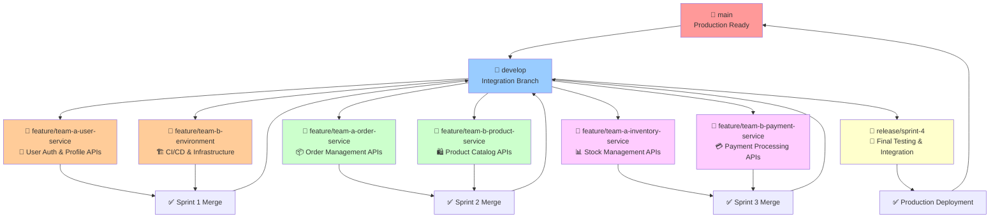

### 🌳 Branch Structure & Rules

| 🌿 Branch Type | 🎯 Purpose | 👥 Access | 🔄 Lifecycle |
|----------------|------------|-----------|--------------|
| **`main`** | Production-ready code | 🔒 Protected | Permanent |
| **`develop`** | Integration branch | All teams | Permanent |
| **`feature/team-X-*`** | Team-specific features | Assigned team | Sprint duration |
| **`release/sprint-X`** | Release preparation | Tech Lead + QA | 2-3 days |
| **`hotfix/critical-*`** | Emergency fixes | Tech Lead only | Hours |

### 🔒 Branch Protection Rules

#### 🛡️ Main Branch Protection
```yaml
# .github/branch-protection.yml
main:
  required_reviews: 2
  required_reviewers: ["tech-lead", "senior-engineer"]
  dismiss_stale_reviews: true
  require_code_owner_reviews: true
  required_status_checks:
    - "ci/tests"
    - "ci/security-scan"
    - "ci/performance-test"
  enforce_admins: true
```

#### 🔐 Develop Branch Protection
```yaml
develop:
  required_reviews: 1
  required_status_checks:
    - "ci/unit-tests"
    - "ci/integration-tests"
  auto_merge_dependabot: true
```

### 🚀 Team Workflow Process

#### 📋 Daily Workflow for Teams

| ⏰ Time | 🎯 Activity | 👥 Responsibility |
|---------|-------------|-------------------|
| **9:00 AM** | Sync from develop | All engineers |
| **9:15 AM** | Stand-up meeting | Scrum Master |
| **9:30 AM** | Feature branch work | Team members |
| **4:00 PM** | Create PR for review | Developer |
| **5:00 PM** | Code review & merge | Tech Lead |

#### 🔄 Sprint Integration Process

```bash
#!/bin/bash
# scripts/team-integration-workflow.sh

echo "🔄 === TEAM INTEGRATION WORKFLOW ==="

# 🌿 Step 1: Create feature branch
git checkout develop
git pull origin develop
git checkout -b feature/team-${TEAM_NAME}-${FEATURE_NAME}

echo "✅ Feature branch created: feature/team-${TEAM_NAME}-${FEATURE_NAME}"

# 🔧 Step 2: Daily sync (run each morning)
git fetch origin
git rebase origin/develop

# ⚠️ Handle conflicts immediately
if [ $? -ne 0 ]; then
    echo "🚨 CONFLICT DETECTED - Resolve immediately!"
    echo "📞 Contact Tech Lead if needed"
    exit 1
fi

# 🧪 Step 3: Pre-push validation
./gradlew clean test
./gradlew checkstyleMain
./gradlew pmdMain

if [ $? -eq 0 ]; then
    echo "✅ All checks passed - Ready to push"
    git push origin feature/team-${TEAM_NAME}-${FEATURE_NAME}
else
    echo "❌ Quality checks failed - Fix before pushing"
    exit 1
fi
```

### 🛡️ Conflict Prevention Strategies

#### 🎯 Code Ownership Matrix

| 📂 Component | 👥 Primary Owner | 🤝 Secondary Owner | 🔍 Reviewer |
|--------------|------------------|-------------------|-------------|
| **User Service** | Team A | Database Engineer | Tech Lead |
| **Order Service** | Team B | Team A | Tech Lead |
| **Product Service** | Team A | Team B | Database Engineer |
| **Database Schema** | Database Engineer | All Teams | Tech Lead |
| **Common Utils** | Tech Lead | All Teams | Senior Engineers |

#### 🚨 Merge Conflict Resolution

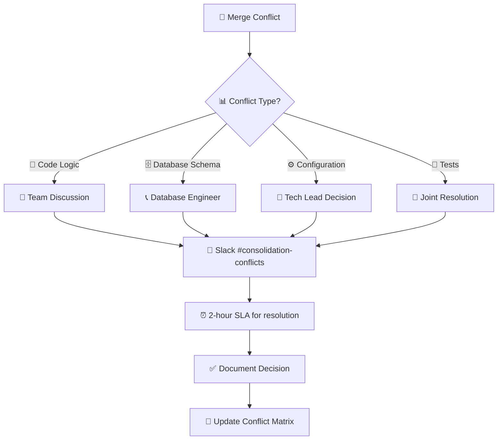

---

## 📈 Project Dashboard & Summary

### 🎯 Success Metrics Dashboard

#### 📊 Key Performance Indicators

| 🎯 KPI | 📈 Target | 📊 Current | 🚦 Status | 📅 Update |
|--------|-----------|------------|-----------|----------|
| **Project Timeline** | 8 weeks | Sprint 1 | 🟢 On Track | Weekly |
| **Team Velocity** | 45 SP/sprint | TBD | ⚪ Pending | Sprint 2 |
| **Budget Utilization** | 100% | 0% | 🟢 Good | Monthly |
| **Risk Mitigation** | <5 open risks | 8 active | 🟡 Monitor | Weekly |
| **Code Quality** | >80% coverage | TBD | ⚪ Pending | Sprint 3 |

#### 🚦 Health Status Overview

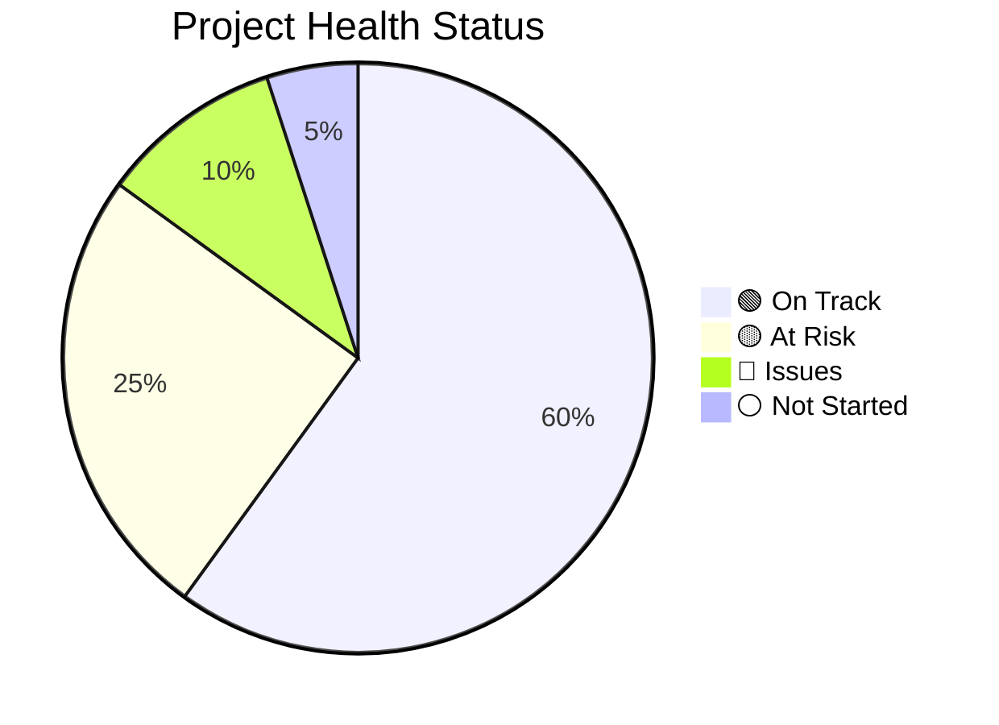

### 📋 Executive Summary

#### 🎯 Project Scope Recap

| 📊 Dimension | 📈 From | 🚀 To | 💰 Benefit |
|--------------|---------|-------|------------|
| **Services** | 3+ microservices | 1 consolidated app | 40% operational cost reduction |
| **Development Team** | Distributed teams | Unified 6-person team | 30% velocity improvement |
| **Database** | Multiple instances | Single PostgreSQL | 50% maintenance reduction |
| **Deployment** | Complex pipelines | Single CI/CD | 60% deployment time reduction |
| **Monitoring** | Fragmented | Centralized | 70% troubleshooting efficiency |

#### ⏱️ Timeline & Milestones

| 🎯 Milestone | 📅 Target Date | 📊 Dependencies | 🚦 Status |
|--------------|----------------|------------------|-----------|
| **User Service Live** | Week 2 | Database migration | 🟢 Planned |
| **Core Services (Order + Product)** | Week 4 | User service foundation | 🟢 Planned |
| **All 5 Services Integrated** | Week 6 | Cross-service dependencies | 🟡 Risk |
| **Production Ready & Go-Live** | Week 8 | Performance validation | 🟡 Risk |

### 📞 Communication Plan

#### 🗣️ Stakeholder Communication Matrix

| 👥 Stakeholder | 📢 Communication Method | ⏰ Frequency | 📊 Content |
|----------------|-------------------------|-------------|------------|
| **Executive Sponsors** | Monthly status report | Monthly | High-level progress, risks, budget |
| **Engineering Managers** | Sprint reviews | Bi-weekly | Technical progress, team health |
| **Product Owners** | Feature demos | Weekly | Functionality validation |
| **End Users** | Change notifications | As needed | Impact assessment, timeline |
| **Infrastructure Team** | Technical sync | Weekly | Environment, deployment, security |

#### 📊 Reporting Schedule

```mermaid
gantt
    title Communication & Reporting Schedule
    dateFormat  X
    axisFormat %s

    section Daily
    Team Standups         :0, 20
    
    section Weekly  
    Sprint Planning       :20, 8
    Sprint Review         :28, 4
    Retrospective         :32, 4
    
    section Monthly
    Executive Reporting   :36, 4
    Stakeholder Review    :40, 8
```

### 🎯 Change Management Strategy

#### 📋 Organizational Change Plan

| 🔄 Change Area | 🎯 Current State | 🚀 Future State | 🛠️ Change Strategy |
|----------------|------------------|-----------------|-------------------|
| **Team Structure** | 3 separate teams | 1 unified team | Cross-training, shared goals |
| **Development Process** | Independent workflows | Shared processes | Process standardization |
| **Technical Skills** | Service-specific | Full-stack | Training program |
| **Ownership Model** | Service silos | Shared ownership | Collaboration framework |

#### 👥 Training & Knowledge Transfer

| 🎓 Training Area | 👥 Target Audience | ⏱️ Duration | 📅 Schedule |
|------------------|-------------------|-------------|-------------|
| **Spring Boot 3.x** | All engineers | 16 hours | Weeks 1-2 |
| **Consolidated Architecture** | All teams | 8 hours | Week 3 |
| **New Deployment Process** | DevOps + Leads | 4 hours | Week 17 |
| **Monitoring & Troubleshooting** | All engineers | 8 hours | Week 19 |

---

## 🎉 Conclusion

### 🏆 Project Success Factors

This comprehensive project management template provides a structured approach to successfully consolidating microservices while managing the complex organizational and technical challenges involved.

#### ✅ Key Success Enablers

| 🎯 Factor | 📊 Impact | 🛠️ Implementation |
|-----------|-----------|-------------------|
| **Clear Ownership Matrix** | High | Prevents conflicts and ensures accountability |
| **Structured Branching Strategy** | High | Enables parallel development without conflicts |
| **Comprehensive RAID Analysis** | Medium | Proactive risk management and mitigation |
| **Detailed Sprint Planning** | High | Predictable delivery and resource optimization |
| **Robust Release Strategy** | High | Safe deployment with minimal business disruption |

#### 🚀 Expected Outcomes

> 📈 **By following this template, organizations can expect:**
> 
> - ✅ **40% reduction** in operational overhead
> - ✅ **30% improvement** in development velocity  
> - ✅ **50% decrease** in deployment complexity
> - ✅ **Zero data loss** during migration
> - ✅ **Seamless team collaboration** across previously siloed services

#### 🔄 Continuous Improvement

| 📊 Review Point | ⏰ Frequency | 🎯 Focus Areas |
|-----------------|-------------|----------------|
| **Sprint Retrospectives** | Bi-weekly | Process improvements, team dynamics |
| **Risk Reviews** | Weekly | Risk mitigation effectiveness |
| **Stakeholder Feedback** | Weekly | Scope alignment, satisfaction |
| **Technical Architecture** | Per Sprint | Performance, scalability, maintainability |

---

<div align="center">

**🎯 Ready to Transform Your Microservices Architecture?**

*Use this template as your comprehensive guide to successful consolidation*


</div>

## 📊 Gantt Chart & Sprint Planning

### 🎯 Project Timeline Overview

> ⏱️ **Duration**: 8 weeks (4 sprints) | 👥 **Team**: 6 engineers | 💼 **Capacity**: 240 hours/week

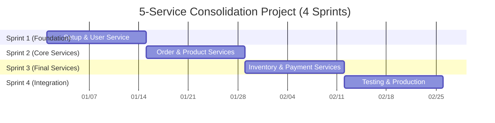

### 👥 Engineer Assignment Gantt Chart

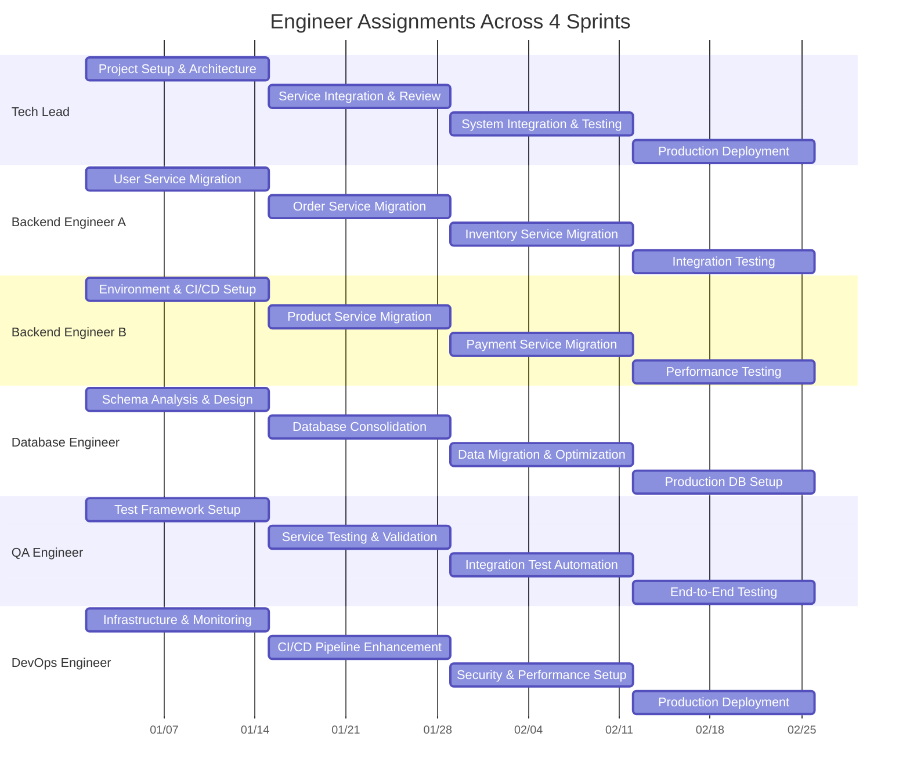

### 📋 Sprint Details & Resource Allocation

#### 🚀 Sprint 1: Foundation & User Service

| 📊 Sprint Info | 🎯 Details |
|----------------|-------------|
| **Duration** | Weeks 1-2 (2024-01-01 to 2024-01-14) |
| **Sprint Goal** | 🏗️ Setup environment + migrate first service (User Management) |
| **Services** | **User Service** (Authentication, User Management) |
| **Capacity** | 480 hours (6 engineers × 80 hours) |

**👥 Engineer Assignments**

| 👤 Engineer | 🎯 Primary Tasks | ⏱️ Hours | 📊 Deliverables |
|-------------|------------------|----------|----------------|
| **🚀 Tech Lead** | Project architecture, User service design | 80h | Architecture docs, User API design |
| **🔧 Backend Engineer A** | User service migration & implementation | 80h | User entities, repositories, services |
| **🔧 Backend Engineer B** | Environment setup, CI/CD pipeline | 80h | Development environment, build pipeline |
| **🗄️ Database Engineer** | Schema analysis, User DB migration | 80h | User tables, migration scripts |
| **🧪 QA Engineer** | Test framework, User service tests | 80h | Test automation, User service validation |
| **☁️ DevOps Engineer** | Infrastructure setup, monitoring | 80h | Dev/staging environments, monitoring |

**📋 Sprint 1 Backlog**

| 🎯 Story | 👥 Owner | ⏱️ Effort | 📊 Story Points | 🎯 Priority |
|----------|----------|-----------|----------------|-------------|
| **User Service - Authentication & Authorization** | Backend Engineer A | 32h | 21 | High |
| **User Service - Profile Management APIs** | Backend Engineer A | 24h | 13 | High |
| **User Database Schema & Migration** | DB Engineer | 24h | 13 | High |
| **CI/CD Pipeline Setup** | Backend Engineer B | 32h | 21 | High |
| **Test Framework & User Service Tests** | QA Engineer | 24h | 13 | High |
| **Development Environment Setup** | DevOps Engineer | 20h | 8 | High |

#### 🛒 Sprint 2: Core Business Services

| 📊 Sprint Info | 🎯 Details |
|----------------|-------------|
| **Duration** | Weeks 3-4 (2024-01-15 to 2024-01-28) |
| **Sprint Goal** | 📦 Migrate core business services (Order + Product) |
| **Services** | **Order Service** + **Product Service** |
| **Capacity** | 480 hours (6 engineers × 80 hours) |

**👥 Engineer Assignments**

| 👤 Engineer | 🎯 Primary Tasks | ⏱️ Hours | 📊 Deliverables |
|-------------|------------------|----------|----------------|
| **🚀 Tech Lead** | Service integration, API contracts | 80h | Integration design, API documentation |
| **🔧 Backend Engineer A** | Order service migration | 80h | Order management, business logic |
| **🔧 Backend Engineer B** | Product service migration | 80h | Product catalog, inventory APIs |
| **🗄️ Database Engineer** | Order & Product DB consolidation | 80h | Consolidated schema, relationships |
| **🧪 QA Engineer** | Order & Product service testing | 80h | Integration tests, API validation |
| **☁️ DevOps Engineer** | Pipeline enhancement, security | 80h | Enhanced CI/CD, security scanning |

**📋 Sprint 2 Backlog**

| 🎯 Story | 👥 Owner | ⏱️ Effort | 📊 Story Points | 🎯 Priority |
|----------|----------|-----------|----------------|-------------|
| **Order Service - Order Management APIs** | Backend Engineer A | 32h | 21 | High |
| **Product Service - Catalog & Inventory APIs** | Backend Engineer B | 32h | 21 | High |
| **Order-Product Database Integration** | DB Engineer | 28h | 13 | High |
| **Cross-Service Integration Testing** | QA Engineer | 32h | 21 | High |
| **API Contract Validation** | Tech Lead | 24h | 13 | High |
| **Security & Performance Optimization** | DevOps Engineer | 24h | 8 | Medium |

#### 💰 Sprint 3: Final Services

| 📊 Sprint Info | 🎯 Details |
|----------------|-------------|
| **Duration** | Weeks 5-6 (2024-01-29 to 2024-02-11) |
| **Sprint Goal** | 📊 Complete service migration (Inventory + Payment) |
| **Services** | **Inventory Service** + **Payment Service** |
| **Capacity** | 480 hours (6 engineers × 80 hours) |

**👥 Engineer Assignments**

| 👤 Engineer | 🎯 Primary Tasks | ⏱️ Hours | 📊 Deliverables |
|-------------|------------------|----------|----------------|
| **🚀 Tech Lead** | System integration, architecture review | 80h | Complete system design, integration validation |
| **🔧 Backend Engineer A** | Inventory service migration | 80h | Stock management, warehouse APIs |
| **🔧 Backend Engineer B** | Payment service migration | 80h | Payment processing, transaction APIs |
| **🗄️ Database Engineer** | Final DB optimization & migration | 80h | Complete consolidated schema |
| **🧪 QA Engineer** | Comprehensive integration testing | 80h | End-to-end test automation |
| **☁️ DevOps Engineer** | Performance tuning, security hardening | 80h | Production-ready infrastructure |

**📋 Sprint 3 Backlog**

| 🎯 Story | 👥 Owner | ⏱️ Effort | 📊 Story Points | 🎯 Priority |
|----------|----------|-----------|----------------|-------------|
| **Inventory Service - Stock Management APIs** | Backend Engineer A | 32h | 21 | High |
| **Payment Service - Transaction Processing** | Backend Engineer B | 32h | 21 | High |
| **Complete Database Schema Integration** | DB Engineer | 32h | 21 | High |
| **End-to-End Integration Testing** | QA Engineer | 32h | 21 | High |
| **System Performance Optimization** | Tech Lead | 24h | 13 | High |
| **Production Infrastructure Preparation** | DevOps Engineer | 24h | 13 | Medium |

#### 🚀 Sprint 4: Integration & Production

| 📊 Sprint Info | 🎯 Details |
|----------------|-------------|
| **Duration** | Weeks 7-8 (2024-02-12 to 2024-02-25) |
| **Sprint Goal** | 🎯 Final integration, testing, and production deployment |
| **Focus** | **System Integration + Production Deployment** |
| **Capacity** | 480 hours (6 engineers × 80 hours) |

**👥 Engineer Assignments**

| 👤 Engineer | 🎯 Primary Tasks | ⏱️ Hours | 📊 Deliverables |
|-------------|------------------|----------|----------------|
| **🚀 Tech Lead** | Production deployment, system validation | 80h | Production deployment, go-live coordination |
| **🔧 Backend Engineer A** | Integration testing, bug fixes | 80h | System integration validation |
| **🔧 Backend Engineer B** | Performance testing, optimization | 80h | Performance benchmarks, optimizations |
| **🗄️ Database Engineer** | Production DB setup, data migration | 80h | Production database, live data migration |
| **🧪 QA Engineer** | Comprehensive testing, user acceptance | 80h | Full system validation, UAT |
| **☁️ DevOps Engineer** | Production deployment, monitoring | 80h | Live deployment, monitoring setup |

**📋 Sprint 4 Backlog**

| 🎯 Story | 👥 Owner | ⏱️ Effort | 📊 Story Points | 🎯 Priority |
|----------|----------|-----------|----------------|-------------|
| **Production Database Migration** | DB Engineer | 32h | 21 | High |
| **Production Deployment & Go-Live** | Tech Lead + DevOps | 32h | 21 | High |
| **Comprehensive System Testing** | QA Engineer | 32h | 21 | High |
| **Performance Validation & Tuning** | Backend Engineer B | 24h | 13 | High |
| **Integration Bug Fixes** | Backend Engineer A | 24h | 13 | High |
| **Production Monitoring & Alerting** | DevOps Engineer | 24h | 13 | Medium |

### 📊 5-Service Migration Overview

#### 🎯 Services to Consolidate

| 🏷️ Service | 📊 Current State | 🎯 Target Sprint | 👥 Lead Engineer |
|-------------|------------------|------------------|------------------|
| **User Service** | Spring Boot 2.7 + MySQL | Sprint 1 | Backend Engineer A |
| **Order Service** | Spring Boot 3.0 + PostgreSQL | Sprint 2 | Backend Engineer A |
| **Product Service** | Spring Boot 2.6 + MySQL | Sprint 2 | Backend Engineer B |
| **Inventory Service** | Node.js + MongoDB | Sprint 3 | Backend Engineer A |
| **Payment Service** | Spring Boot 2.5 + MySQL | Sprint 3 | Backend Engineer B |

### 📈 Resource Utilization Chart

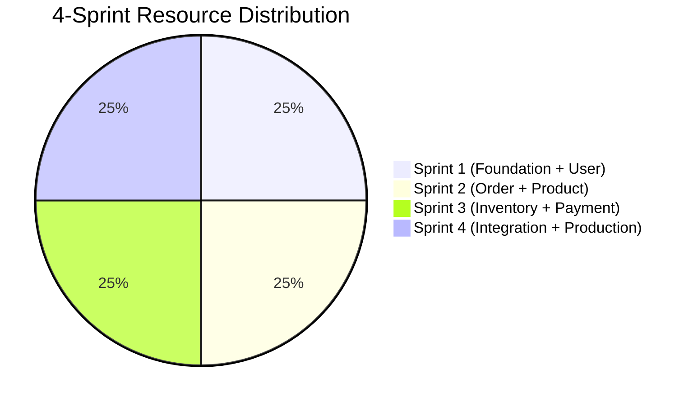

---

## 🔄 Conflict Resolution

### 🎯 Governance Framework

> 🤝 **Philosophy**: Clear escalation paths, defined ownership, and collaborative decision-making to prevent and resolve conflicts quickly.

### 👑 Ownership & Accountability Matrix

#### 🏗️ Service Ownership Model

| 📂 Component | 👑 Primary Owner | 🤝 Secondary Owner | 🔍 Reviewer | 📞 Escalation |
|--------------|------------------|-------------------|-------------|---------------|
| **User Management** | Backend Team A | DB Engineer | Tech Lead | Engineering Manager |
| **Order Processing** | Backend Team B | Backend Team A | Tech Lead | Engineering Manager |
| **Database Schema** | DB Engineer | All Teams | Tech Lead | Senior Architect |
| **API Contracts** | Tech Lead | Service Owners | QA Engineer | Engineering Manager |
| **Infrastructure** | DevOps | Platform Team | Tech Lead | Infrastructure Manager |
| **Security** | Security Engineer | All Teams | Tech Lead | Security Manager |

#### 🚨 Conflict Escalation Matrix

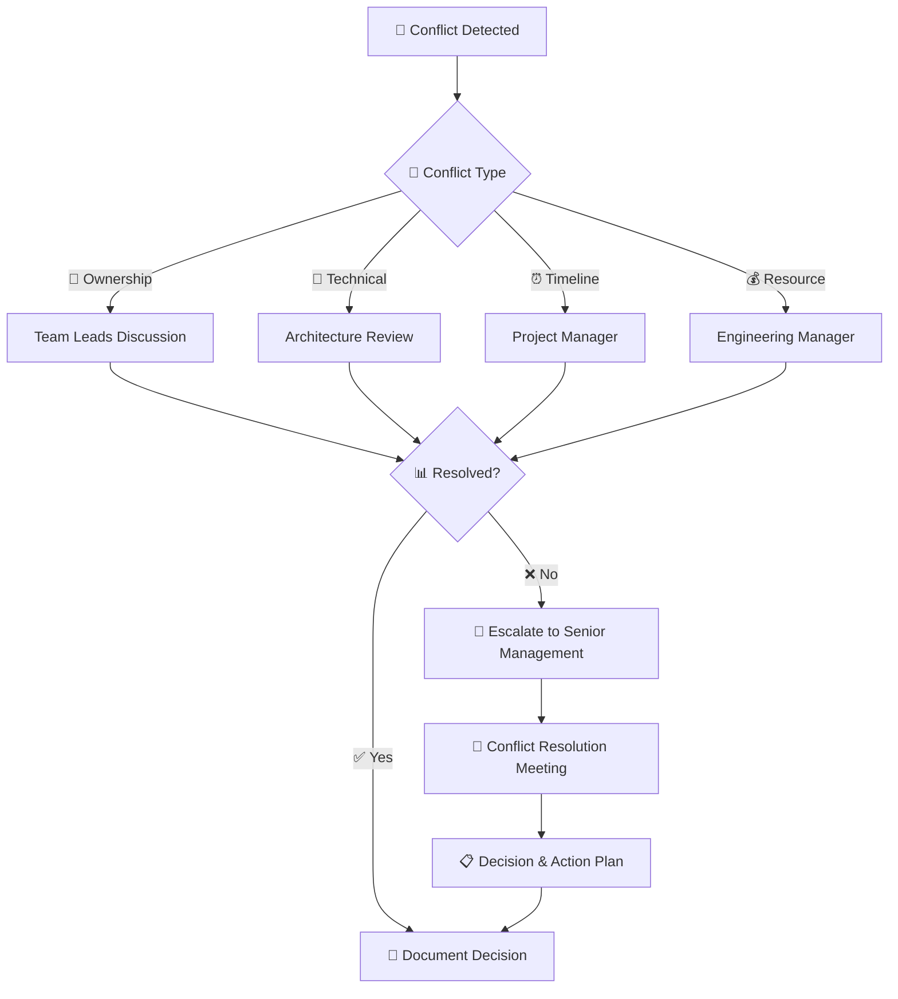

### 🛠️ Service Management Conflicts

#### 📊 Service Boundary Disputes

| 🚨 Conflict Scenario | 🎯 Resolution Process | ⏱️ SLA | 👥 Decision Maker |
|---------------------|----------------------|---------|-------------------|
| **API Ownership Overlap** | Architecture Review Board | 2 days | Tech Lead + Senior Architect |
| **Data Model Conflicts** | Database Design Meeting | 1 day | DB Engineer + Teams |
| **Feature Responsibility** | Product Owner Meeting | 4 hours | Product Owner + Tech Lead |
| **Testing Ownership** | QA Strategy Session | 4 hours | QA Engineer + Team Leads |

#### 🔧 Technical Decision Framework

```yaml
# Technical Decision Template
decision_template:
  title: "API Design for User Service"
  stakeholders:
    - backend_team_a
    - backend_team_b
    - tech_lead
    - qa_engineer
  
  options:
    option_1:
      description: "RESTful API with OpenAPI spec"
      pros: ["Standard approach", "Good tooling"]
      cons: ["More verbose"]
      effort: "Medium"
    
    option_2:
      description: "GraphQL API"
      pros: ["Flexible queries", "Type safety"]
      cons: ["Learning curve", "Complexity"]
      effort: "High"
  
  decision_criteria:
    - team_expertise: 40%
    - maintainability: 30%
    - performance: 20%
    - time_to_market: 10%
  
  decision: "option_1"
  rationale: "Team has more experience with REST APIs"
  review_date: "2024-02-15"
```

### 🚨 Operations & Incident Management

#### 🔥 Incident Response Hierarchy

| 🚨 Severity | ⏱️ Response Time | 👥 Primary Responder | 🤝 Secondary Support | 📞 Escalation Path |
|-------------|-----------------|---------------------|---------------------|-------------------|
| **P0 - Critical** | 15 minutes | On-call Engineer | Tech Lead | Engineering Manager → CTO |
| **P1 - High** | 1 hour | Service Owner | Team Members | Team Lead → Engineering Manager |
| **P2 - Medium** | 4 hours | Service Owner | - | Team Lead (if needed) |
| **P3 - Low** | Next business day | Service Owner | - | - |

#### 🎛️ Incident Command Structure

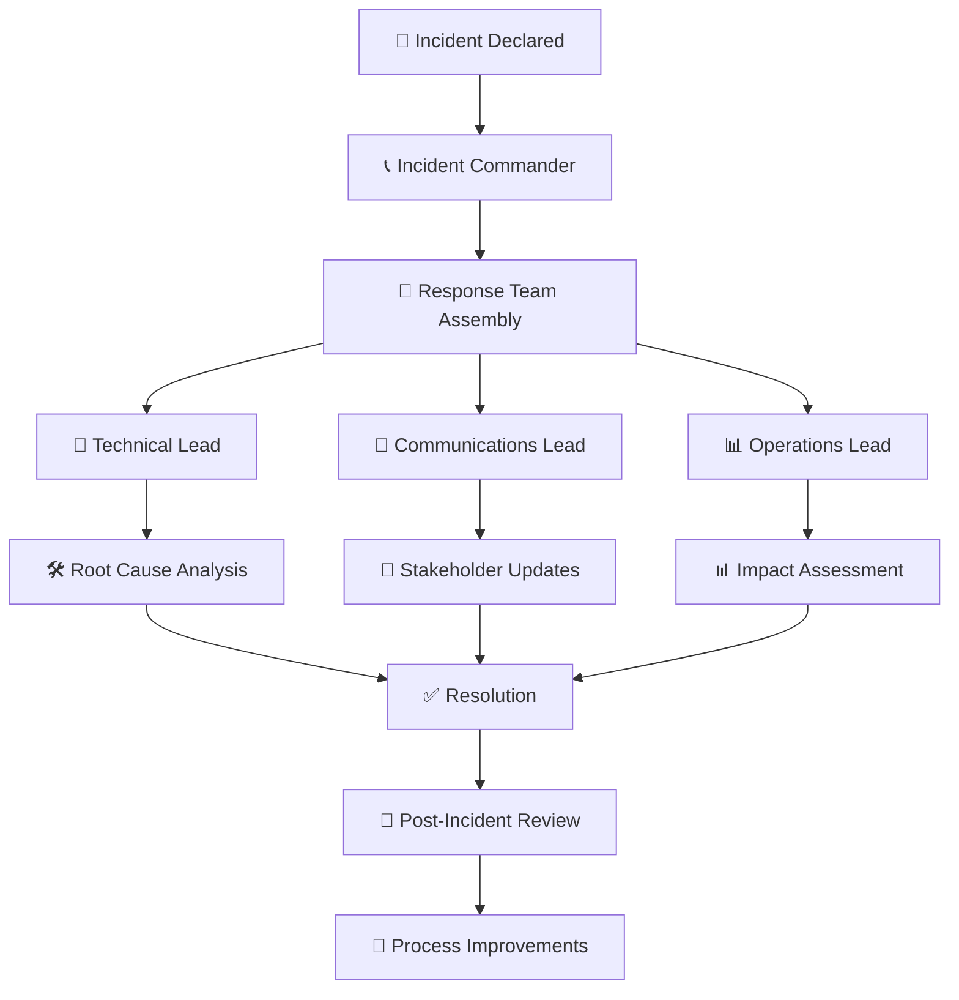

### 🔄 Change Management Process

#### 📋 Change Advisory Board (CAB)

| 👥 Role | 🎯 Responsibility | 📊 Authority Level |
|---------|-------------------|-------------------|
| **Change Manager** | Process oversight, risk assessment | Final approval for standard changes |
| **Tech Lead** | Technical impact evaluation | Veto power for high-risk changes |
| **Security Representative** | Security impact review | Mandatory approval for security-related changes |
| **Operations Representative** | Operational impact assessment | Mandatory approval for infrastructure changes |
| **Business Representative** | Business impact evaluation | Approval for customer-facing changes |

#### 🔄 Change Classification Matrix

| 📊 Change Type | 📈 Risk Level | 👥 Approval Required | ⏱️ Lead Time |
|----------------|---------------|---------------------|-------------|
| **Emergency** | High | Change Manager + Tech Lead | 1 hour |
| **Standard** | Low | Automated approval | 24 hours |
| **Normal** | Medium | CAB Review | 3-5 days |
| **Major** | High | Full CAB + Senior Management | 1-2 weeks |

### 🚀 Release Management Conflicts

#### 📅 Release Coordination Process

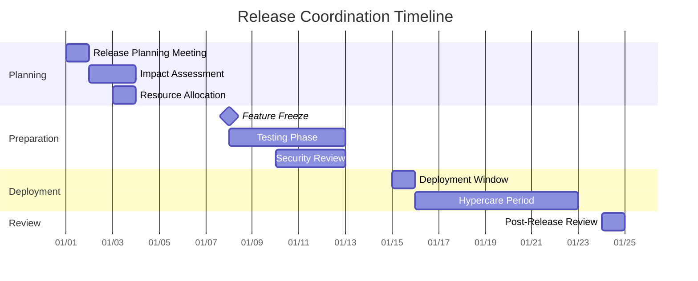

#### 🎯 Release Conflict Resolution

| 🚨 Conflict Type | 🎯 Resolution Process | ⏱️ SLA | 👥 Arbitrator |
|------------------|----------------------|---------|---------------|
| **Overlapping Release Windows** | Release calendar review | 24 hours | Release Manager |
| **Resource Competition** | Capacity planning meeting | 48 hours | Engineering Manager |
| **Priority Disputes** | Product roadmap review | 2 days | Product Owner + Tech Lead |
| **Quality Gate Failures** | Quality review board | 4 hours | QA Engineer + Tech Lead |

### 📞 Communication Protocols

#### 🗣️ Conflict Communication Channels

| 📢 Channel | 🎯 Purpose | 👥 Audience | ⏱️ Response SLA |
|------------|------------|-------------|-----------------|
| **#consolidation-conflicts** | Real-time conflict resolution | All team members | 2 hours |
| **Weekly sync meetings** | Proactive conflict prevention | Team leads | N/A |
| **Escalation emails** | Formal escalation process | Management chain | 4 hours |
| **Emergency hotline** | Critical production issues | On-call personnel | 15 minutes |

#### 📝 Decision Documentation Template

```markdown
# Decision Record: [Title]

**Date**: YYYY-MM-DD
**Status**: [Proposed/Accepted/Rejected/Superseded]
**Stakeholders**: [List of involved parties]

## Context
[Describe the situation and conflict]

## Decision
[Describe the decision made]

## Rationale
[Explain why this decision was made]

## Consequences
[Describe expected outcomes and impacts]

## Action Items
- [ ] [Action 1] - Assigned to: [Name] - Due: [Date]
- [ ] [Action 2] - Assigned to: [Name] - Due: [Date]

## Review Date
[When will this decision be reviewed]
```

---

## 🚀 Release Strategy

### 🎯 Multi-Stage Deployment Pipeline

> 🛡️ **Philosophy**: Zero-downtime deployments with progressive rollout and automated rollback capabilities

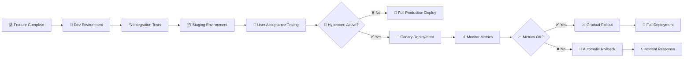

### 🐣 Canary Deployment Strategy

#### 📊 Traffic Routing Configuration

| 🔄 Phase | 📈 Traffic % | ⏱️ Duration | 🎯 Success Criteria |
|----------|-------------|-------------|-------------------|
| **Canary** | 5% | 30 minutes | Error rate <0.1% |
| **Blue-Green** | 25% | 2 hours | Response time <200ms |
| **Progressive** | 50% | 4 hours | Memory usage stable |
| **Full Rollout** | 100% | - | All metrics green |

```yaml
# k8s/canary-deployment.yaml
apiVersion: v1
kind: Service
metadata:
  name: consolidated-service
spec:
  selector:
    app: consolidated-service
  ports:
  - port: 8080
---
apiVersion: apps/v1
kind: Deployment
metadata:
  name: consolidated-service-canary
  labels:
    version: canary
spec:
  replicas: 1  # 5% of total traffic
  selector:
    matchLabels:
      app: consolidated-service
      version: canary
  template:
    metadata:
      labels:
        app: consolidated-service
        version: canary
    spec:
      containers:
      - name: app
        image: consolidated-service:latest
        env:
        - name: SPRING_PROFILES_ACTIVE
          value: "canary"
```

### 🚨 Hypercare Scenario Management

#### 🛡️ When Another Team is in Hypercare

| 🚨 Scenario | 🎯 Strategy | ⏱️ Timeline | 🔄 Actions |
|-------------|-------------|-------------|-----------|
| **Critical P0 Issue** | ⏸️ Freeze all releases | Until resolved | Monitor only |
| **P1 Incident Active** | 🐣 Canary only | 24-48 hours | 5% traffic max |
| **Post-Incident** | 📊 Enhanced monitoring | 1 week | Extended validation |
| **Recovery Period** | 🔄 Gradual resumption | 2 weeks | Phased approach |

#### 🔄 Hypercare Communication Protocol

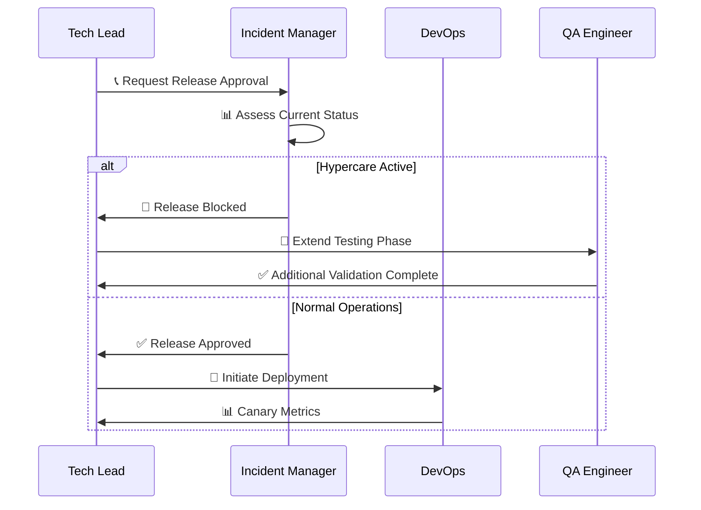

### 🎛️ Release Coordination Matrix

#### 👥 Cross-Team Release Dependencies

| 🏷️ Team | 🚀 Release Window | 🤝 Dependencies | 📞 Contact | 🚨 Escalation |
|----------|------------------|-----------------|-----------|---------------|
| **Team Alpha** | Mon/Wed 10 AM | Database changes | @alpha-lead | @alpha-manager |
| **Team Beta** | Tue/Thu 2 PM | API contracts | @beta-lead | @beta-manager |
| **Platform Team** | Fri 6 PM | Infrastructure | @platform-lead | @cto |
| **Consolidation Team** | Wed 4 PM | All services | @tech-lead | @engineering-manager |

---

## ⚠️ RAID Analysis

### 🚨 Risks

#### 🔴 High Impact Risks

| 🎯 Risk | 📊 Probability | 💥 Impact | 🛡️ Mitigation Strategy | 👥 Owner |
|---------|---------------|-----------|------------------------|----------|
| **Database Migration Failure** | Medium | High | Comprehensive backup + rollback scripts | DB Engineer |
| **API Breaking Changes** | High | High | Contract testing + versioning strategy | Tech Lead |
| **Performance Degradation** | Medium | High | Load testing + performance baselines | QA Engineer |
| **Team Knowledge Silos** | High | Medium | Cross-training + documentation | All Teams |
| **Scope Creep** | High | Medium | Sprint planning discipline + stakeholder alignment | Scrum Master |

#### 🟡 Medium Impact Risks

| 🎯 Risk | 📊 Probability | 💥 Impact | 🛡️ Mitigation Strategy | 👥 Owner |
|---------|---------------|-----------|------------------------|----------|
| **Third-party Service Changes** | Low | Medium | Service abstraction layer | Backend Engineers |
| **Resource Conflicts** | Medium | Medium | Capacity planning + buffer time | Tech Lead |
| **Security Vulnerabilities** | Low | High | Security scanning + code review | DevOps |
| **Data Inconsistency** | Medium | Medium | Transaction management + validation | DB Engineer |

#### 🚨 Risk Monitoring Dashboard

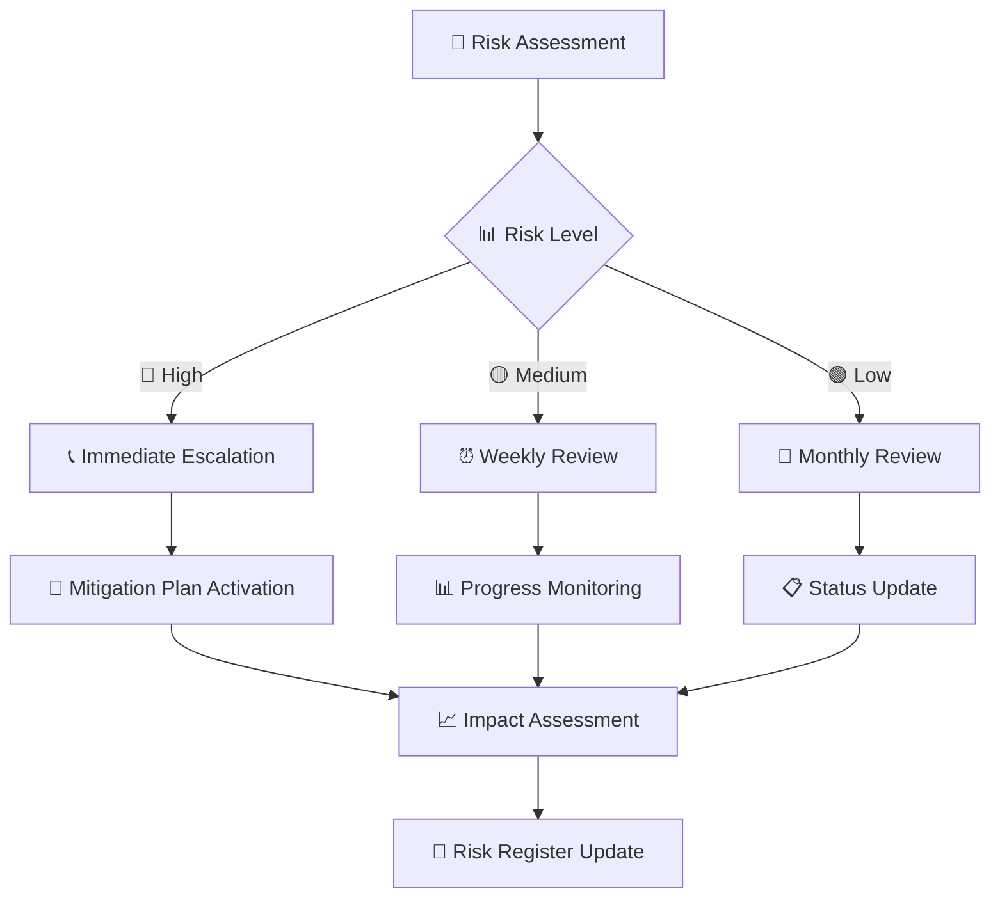

### 🎯 Assumptions

#### 🏗️ Technical Assumptions

| 🔧 Assumption | ✅ Validation Criteria | 📊 Risk Level | 🔍 Verification Method |
|---------------|----------------------|---------------|----------------------|
| **Spring Boot 3.x compatibility** | All dependencies migrate cleanly | Low | Dependency audit |
| **Database schema compatibility** | No breaking schema changes | Medium | Schema comparison tool |
| **Team skill coverage** | All required skills available | Medium | Skills matrix assessment |
| **Infrastructure capacity** | Current infra handles consolidated load | High | Load testing |

#### 👥 Business Assumptions

| 🎯 Assumption | ✅ Validation Criteria | 📊 Risk Level | 🔍 Verification Method |
|---------------|----------------------|---------------|----------------------|
| **Stakeholder availability** | Key stakeholders available for decisions | Medium | Calendar blocking |
| **Business continuity** | No major business changes during project | Low | Stakeholder confirmation |
| **Budget allocation** | Sufficient budget for 20 weeks | High | Finance approval |
| **Timeline flexibility** | 2-week buffer acceptable | Medium | Sponsor agreement |

### 🚧 Issues

#### 🔥 Current Active Issues

| 🚨 Issue | 📈 Priority | 📅 Raised Date | 👥 Assigned To | 🎯 Target Resolution |
|----------|-------------|----------------|----------------|-------------------|
| **Legacy code dependencies** | High | Week 1 | Backend Team | Week 3 |
| **Test environment setup** | Medium | Week 1 | DevOps | Week 2 |
| **API documentation gaps** | Medium | Week 2 | All Teams | Week 4 |
| **Performance baseline missing** | High | Week 2 | QA Engineer | Week 3 |

#### 📊 Issue Tracking Process

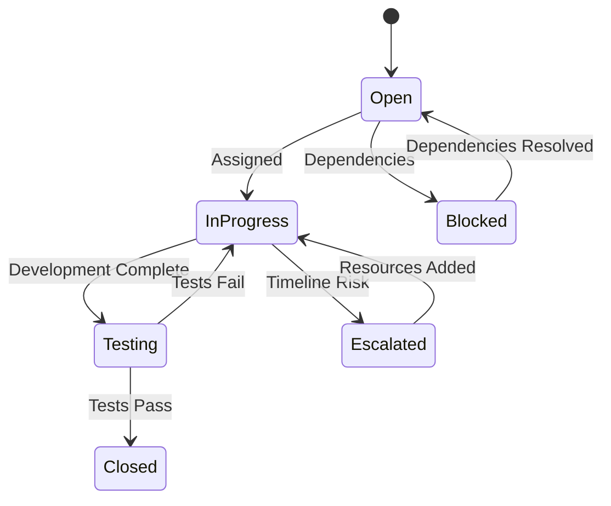

### 🔗 Dependencies

#### 🏗️ External Dependencies

| 🔗 Dependency | 👥 Provider | ⏱️ Required By | 🚨 Risk Level | 🎯 Contingency Plan |
|---------------|-------------|---------------|---------------|-------------------|
| **Database Migration Scripts** | DB Team | Sprint 3 | High | Manual migration procedures |
| **Infrastructure Provisioning** | Platform Team | Sprint 1 | Medium | Cloud provider backup |
| **Security Approval** | Security Team | Sprint 8 | Medium | Parallel approval process |
| **Load Balancer Configuration** | Network Team | Sprint 9 | Low | Manual configuration |

#### 🔄 Internal Dependencies

| 🔗 Dependency | 👥 Team | ⏱️ Required By | 🎯 Deliverable | 📊 Status |
|---------------|---------|---------------|----------------|-----------|
| **User Service API** | Backend Team A | Sprint 4 | REST endpoints | In Progress |
| **Database Schema** | DB Engineer | Sprint 3 | Migration scripts | Planned |
| **Testing Framework** | QA Engineer | Sprint 2 | Test automation | In Progress |
| **CI/CD Pipeline** | DevOps | Sprint 1 | Build automation | Complete |

#### 🔗 Dependency Management Matrix

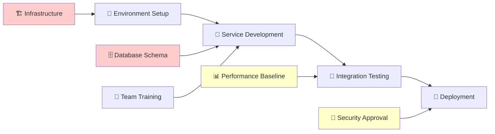

--- 