# 📊 Microservice Consolidation Project
## 🎯 Project Management Template

<div align="center">


-green)


</div>

---

> 🎯 **Project Mission**: Successfully consolidate multiple microservices into a unified, scalable Spring Boot application while minimizing business disruption and maximizing team collaboration.

---

## 📚 Table of Contents

| 🔗 Section | 📖 Chapter | 📊 Focus Area |
|-------------|-------------|---------------|
| 🎯 | [Project Overview](#-project-overview) | Scope & Objectives |
| 👥 | [Team Structure](#-team-structure) | Roles & Responsibilities |
| 📅 | [Sprint Planning](#-sprint-planning) | Timeline & Milestones |
| 🌿 | [Branching Strategy](#-branching-strategy) | Version Control |
| 🚀 | [Release Strategy](#-release-strategy) | Deployment & Rollout |
| ⚠️ | [RAID Analysis](#️-raid-analysis) | Risk Management |
| 🔄 | [Conflict Resolution](#-conflict-resolution) | Process Management |
| 📊 | [Gantt Chart](#-gantt-chart) | Visual Timeline |
| 📋 | [Sprint Details](#-sprint-details) | Detailed Planning |

---

## 🎯 Project Overview

### 📋 Project Scope

| 🎯 Component | 📊 Current State | 🚀 Target State |
|--------------|------------------|-----------------|
| **Services** | 3+ independent microservices | 1 unified Spring Boot application |
| **Databases** | Multiple DB instances | Single PostgreSQL database |
| **Teams** | 6 engineers across services | Unified development team |
| **Deployment** | Separate deployment pipelines | Single CI/CD pipeline |
| **Monitoring** | Distributed logging/metrics | Centralized observability |

### 🎯 Success Criteria

| ✅ Objective | 📊 Metric | 🎯 Target |
|--------------|-----------|----------|
| **Zero Data Loss** | Data integrity validation | 100% |
| **Performance** | Response time improvement | ≥20% faster |
| **Team Efficiency** | Development velocity | ≥30% increase |
| **Operational Overhead** | Infrastructure cost reduction | ≥40% savings |
| **Code Quality** | Test coverage | ≥80% |

---

## 👥 Team Structure

### 🏗️ Core Team Roles

| 👤 Role | 🎯 Responsibilities | 📊 Allocation |
|---------|-------------------|---------------|
| **🚀 Tech Lead** | Architecture, code review, technical decisions | 1 engineer |
| **🔧 Backend Engineers** | Service consolidation, API development | 3 engineers |
| **🗄️ Database Engineer** | Schema migration, performance optimization | 1 engineer |
| **🧪 QA Engineer** | Testing strategy, automation, validation | 1 engineer |

### 📊 Team Capacity Planning


### 🎯 Success Metrics

| 📊 KPI | 🎯 Target | 📈 Measurement |
|--------|----------|----------------|
| **Sprint Velocity** | 40-50 story points | Burndown charts |
| **Code Quality** | 0 critical bugs | Static analysis |
| **Team Satisfaction** | ≥8/10 rating | Sprint retrospectives |
| **Knowledge Transfer** | 100% documentation | Review completion |

---

## 🌿 Branching Strategy

### 🎯 Multi-Team Git Workflow

> 🔄 **Strategy**: Feature Branch + GitFlow hybrid to prevent team conflicts and enable parallel development

```mermaid
gitgraph
    commit id: "Initial"
    branch develop
    commit id: "Dev Setup"
    
    branch feature/team-a-user-service
    commit id: "User API"
    commit id: "User Tests"
    
    branch feature/team-b-order-service
    commit id: "Order Logic"
    commit id: "Order Tests"
    
    checkout develop
    merge feature/team-a-user-service
    
    branch release/sprint-1
    commit id: "Release Prep"
    
    checkout main
    merge release/sprint-1
    tag: "v1.0.0"
    
    checkout develop
    merge feature/team-b-order-service
```

### 🌳 Branch Structure & Rules

| 🌿 Branch Type | 🎯 Purpose | 👥 Access | 🔄 Lifecycle |
|----------------|------------|-----------|--------------|
| **`main`** | Production-ready code | 🔒 Protected | Permanent |
| **`develop`** | Integration branch | All teams | Permanent |
| **`feature/team-X-*`** | Team-specific features | Assigned team | Sprint duration |
| **`release/sprint-X`** | Release preparation | Tech Lead + QA | 2-3 days |
| **`hotfix/critical-*`** | Emergency fixes | Tech Lead only | Hours |

### 🔒 Branch Protection Rules

#### 🛡️ Main Branch Protection
```yaml
# .github/branch-protection.yml
main:
  required_reviews: 2
  required_reviewers: ["tech-lead", "senior-engineer"]
  dismiss_stale_reviews: true
  require_code_owner_reviews: true
  required_status_checks:
    - "ci/tests"
    - "ci/security-scan"
    - "ci/performance-test"
  enforce_admins: true
```

#### 🔐 Develop Branch Protection
```yaml
develop:
  required_reviews: 1
  required_status_checks:
    - "ci/unit-tests"
    - "ci/integration-tests"
  auto_merge_dependabot: true
```

### 🚀 Team Workflow Process

#### 📋 Daily Workflow for Teams

| ⏰ Time | 🎯 Activity | 👥 Responsibility |
|---------|-------------|-------------------|
| **9:00 AM** | Sync from develop | All engineers |
| **9:15 AM** | Stand-up meeting | Scrum Master |
| **9:30 AM** | Feature branch work | Team members |
| **4:00 PM** | Create PR for review | Developer |
| **5:00 PM** | Code review & merge | Tech Lead |

#### 🔄 Sprint Integration Process

```bash
#!/bin/bash
# scripts/team-integration-workflow.sh

echo "🔄 === TEAM INTEGRATION WORKFLOW ==="

# 🌿 Step 1: Create feature branch
git checkout develop
git pull origin develop
git checkout -b feature/team-${TEAM_NAME}-${FEATURE_NAME}

echo "✅ Feature branch created: feature/team-${TEAM_NAME}-${FEATURE_NAME}"

# 🔧 Step 2: Daily sync (run each morning)
git fetch origin
git rebase origin/develop

# ⚠️ Handle conflicts immediately
if [ $? -ne 0 ]; then
    echo "🚨 CONFLICT DETECTED - Resolve immediately!"
    echo "📞 Contact Tech Lead if needed"
    exit 1
fi

# 🧪 Step 3: Pre-push validation
./gradlew clean test
./gradlew checkstyleMain
./gradlew pmdMain

if [ $? -eq 0 ]; then
    echo "✅ All checks passed - Ready to push"
    git push origin feature/team-${TEAM_NAME}-${FEATURE_NAME}
else
    echo "❌ Quality checks failed - Fix before pushing"
    exit 1
fi
```

### 🛡️ Conflict Prevention Strategies

#### 🎯 Code Ownership Matrix

| 📂 Component | 👥 Primary Owner | 🤝 Secondary Owner | 🔍 Reviewer |
|--------------|------------------|-------------------|-------------|
| **User Service** | Team A | Database Engineer | Tech Lead |
| **Order Service** | Team B | Team A | Tech Lead |
| **Product Service** | Team A | Team B | Database Engineer |
| **Database Schema** | Database Engineer | All Teams | Tech Lead |
| **Common Utils** | Tech Lead | All Teams | Senior Engineers |

#### 🚨 Merge Conflict Resolution

```mermaid
flowchart TD
    A[🔄 Merge Conflict] --> B{📊 Conflict Type?}
    
    B -->|📝 Code Logic| C[👥 Team Discussion]
    B -->|🗄️ Database Schema| D[📞 Database Engineer]
    B -->|⚙️ Configuration| E[🚀 Tech Lead Decision]
    B -->|🧪 Tests| F[🤝 Joint Resolution]
    
    C --> G[💬 Slack #consolidation-conflicts]
    D --> G
    E --> G
    F --> G
    
    G --> H[⏰ 2-hour SLA for resolution]
    H --> I[✅ Document Decision]
    I --> J[🔄 Update Conflict Matrix]
```



---

## 📈 Project Dashboard & Summary

### 🎯 Success Metrics Dashboard

#### 📊 Key Performance Indicators

| 🎯 KPI | 📈 Target | 📊 Current | 🚦 Status | 📅 Update |
|--------|-----------|------------|-----------|----------|
| **Project Timeline** | 20 weeks | Sprint 1 | 🟢 On Track | Weekly |
| **Team Velocity** | 45 SP/sprint | TBD | ⚪ Pending | Sprint 2 |
| **Budget Utilization** | 100% | 0% | 🟢 Good | Monthly |
| **Risk Mitigation** | <5 open risks | 8 active | 🟡 Monitor | Weekly |
| **Code Quality** | >80% coverage | TBD | ⚪ Pending | Sprint 3 |

#### 🚦 Health Status Overview

```mermaid
pie title Project Health Status
    "🟢 On Track" : 60
    "🟡 At Risk" : 25
    "🔴 Issues" : 10
    "⚪ Not Started" : 5
```



### 📋 Executive Summary

#### 🎯 Project Scope Recap

| 📊 Dimension | 📈 From | 🚀 To | 💰 Benefit |
|--------------|---------|-------|------------|
| **Services** | 3+ microservices | 1 consolidated app | 40% operational cost reduction |
| **Development Team** | Distributed teams | Unified 6-person team | 30% velocity improvement |
| **Database** | Multiple instances | Single PostgreSQL | 50% maintenance reduction |
| **Deployment** | Complex pipelines | Single CI/CD | 60% deployment time reduction |
| **Monitoring** | Fragmented | Centralized | 70% troubleshooting efficiency |

#### ⏱️ Timeline & Milestones

| 🎯 Milestone | 📅 Target Date | 📊 Dependencies | 🚦 Status |
|--------------|----------------|------------------|-----------|
| **Environment Ready** | Week 2 | Infrastructure team | 🟢 Planned |
| **User Service Live** | Week 6 | Database migration | 🟢 Planned |
| **Database Consolidated** | Week 8 | All service analysis | 🟢 Planned |
| **Full Integration** | Week 12 | Cross-team coordination | 🟡 Risk |
| **Production Ready** | Week 18 | Performance validation | 🟡 Risk |
| **Go-Live Complete** | Week 20 | Stakeholder approval | 🟢 Planned |

### 📞 Communication Plan

#### 🗣️ Stakeholder Communication Matrix

| 👥 Stakeholder | 📢 Communication Method | ⏰ Frequency | 📊 Content |
|----------------|-------------------------|-------------|------------|
| **Executive Sponsors** | Monthly status report | Monthly | High-level progress, risks, budget |
| **Engineering Managers** | Sprint reviews | Bi-weekly | Technical progress, team health |
| **Product Owners** | Feature demos | Weekly | Functionality validation |
| **End Users** | Change notifications | As needed | Impact assessment, timeline |
| **Infrastructure Team** | Technical sync | Weekly | Environment, deployment, security |

#### 📊 Reporting Schedule


### 🎯 Change Management Strategy

#### 📋 Organizational Change Plan

| 🔄 Change Area | 🎯 Current State | 🚀 Future State | 🛠️ Change Strategy |
|----------------|------------------|-----------------|-------------------|
| **Team Structure** | 3 separate teams | 1 unified team | Cross-training, shared goals |
| **Development Process** | Independent workflows | Shared processes | Process standardization |
| **Technical Skills** | Service-specific | Full-stack | Training program |
| **Ownership Model** | Service silos | Shared ownership | Collaboration framework |

#### 👥 Training & Knowledge Transfer

| 🎓 Training Area | 👥 Target Audience | ⏱️ Duration | 📅 Schedule |
|------------------|-------------------|-------------|-------------|
| **Spring Boot 3.x** | All engineers | 16 hours | Weeks 1-2 |
| **Consolidated Architecture** | All teams | 8 hours | Week 3 |
| **New Deployment Process** | DevOps + Leads | 4 hours | Week 17 |
| **Monitoring & Troubleshooting** | All engineers | 8 hours | Week 19 |

---

## 🎉 Conclusion

### 🏆 Project Success Factors

This comprehensive project management template provides a structured approach to successfully consolidating microservices while managing the complex organizational and technical challenges involved.

#### ✅ Key Success Enablers

| 🎯 Factor | 📊 Impact | 🛠️ Implementation |
|-----------|-----------|-------------------|
| **Clear Ownership Matrix** | High | Prevents conflicts and ensures accountability |
| **Structured Branching Strategy** | High | Enables parallel development without conflicts |
| **Comprehensive RAID Analysis** | Medium | Proactive risk management and mitigation |
| **Detailed Sprint Planning** | High | Predictable delivery and resource optimization |
| **Robust Release Strategy** | High | Safe deployment with minimal business disruption |

#### 🚀 Expected Outcomes

> 📈 **By following this template, organizations can expect:**
> 
> - ✅ **40% reduction** in operational overhead
> - ✅ **30% improvement** in development velocity  
> - ✅ **50% decrease** in deployment complexity
> - ✅ **Zero data loss** during migration
> - ✅ **Seamless team collaboration** across previously siloed services

#### 🔄 Continuous Improvement

| 📊 Review Point | ⏰ Frequency | 🎯 Focus Areas |
|-----------------|-------------|----------------|
| **Sprint Retrospectives** | Bi-weekly | Process improvements, team dynamics |
| **Risk Reviews** | Weekly | Risk mitigation effectiveness |
| **Stakeholder Feedback** | Monthly | Scope alignment, satisfaction |
| **Technical Architecture** | Quarterly | Performance, scalability, maintainability |

---

<div align="center">

**🎯 Ready to Transform Your Microservices Architecture?**

*Use this template as your comprehensive guide to successful consolidation*


</div>

## 📊 Gantt Chart & Sprint Planning

### 🎯 Project Timeline Overview

> ⏱️ **Duration**: 20 weeks (10 sprints) | 👥 **Team**: 6 engineers | 💼 **Capacity**: 240 hours/week


### 📋 Sprint Details & Resource Allocation

#### 🚀 Sprint 1: Foundation & Environment Setup

| 📊 Sprint Info | 🎯 Details |
|----------------|-------------|
| **Duration** | Weeks 1-2 (2024-01-01 to 2024-01-14) |
| **Sprint Goal** | 🏗️ Establish development environment and team foundation |
| **Capacity** | 480 hours (6 engineers × 80 hours) |

**📋 Sprint 1 Backlog**

| 🎯 Story | 👥 Owner | ⏱️ Effort | 📊 Story Points | 🎯 Priority |
|----------|----------|-----------|----------------|-------------|
| **Setup consolidated project structure** | Tech Lead | 16h | 8 | High |
| **Configure CI/CD pipeline** | DevOps Engineer | 32h | 13 | High |
| **Database environment setup** | DB Engineer | 24h | 8 | High |
| **Team onboarding & knowledge transfer** | All Teams | 40h | 21 | High |
| **Development tooling setup** | Backend Engineers | 24h | 8 | Medium |
| **Quality gates configuration** | QA Engineer | 20h | 8 | Medium |

**📈 Sprint 1 Capacity Planning**


#### 🔍 Sprint 2: Analysis & Compatibility Assessment

| 📊 Sprint Info | 🎯 Details |
|----------------|-------------|
| **Duration** | Weeks 3-4 (2024-01-15 to 2024-01-28) |
| **Sprint Goal** | 📊 Complete service analysis and create detailed migration plan |
| **Capacity** | 480 hours (6 engineers × 80 hours) |

**📋 Sprint 2 Backlog**

| 🎯 Story | 👥 Owner | ⏱️ Effort | 📊 Story Points | 🎯 Priority |
|----------|----------|-----------|----------------|-------------|
| **API compatibility analysis** | Backend Teams | 40h | 21 | High |
| **Database schema mapping** | DB Engineer | 32h | 13 | High |
| **Dependency conflict resolution** | Tech Lead | 24h | 13 | High |
| **Performance baseline establishment** | QA Engineer | 32h | 13 | High |
| **Migration strategy documentation** | All Teams | 24h | 8 | Medium |
| **Risk assessment & mitigation planning** | Tech Lead | 16h | 8 | Medium |

#### 🔧 Sprint 3: User Service Migration

| 📊 Sprint Info | 🎯 Details |
|----------------|-------------|
| **Duration** | Weeks 5-6 (2024-01-29 to 2024-02-11) |
| **Sprint Goal** | 👤 Migrate and consolidate user management functionality |
| **Capacity** | 480 hours (6 engineers × 80 hours) |

**📋 Sprint 3 Backlog**

| 🎯 Story | 👥 Owner | ⏱️ Effort | 📊 Story Points | 🎯 Priority |
|----------|----------|-----------|----------------|-------------|
| **User entity & repository migration** | Backend Team A | 32h | 13 | High |
| **User service business logic** | Backend Team A | 40h | 21 | High |
| **User API endpoints implementation** | Backend Team A | 32h | 13 | High |
| **User service unit tests** | QA Engineer | 24h | 8 | High |
| **Database migration scripts** | DB Engineer | 24h | 8 | Medium |
| **API documentation** | Backend Team A | 16h | 5 | Medium |

#### 🗄️ Sprint 4: Database Consolidation

| 📊 Sprint Info | 🎯 Details |
|----------------|-------------|
| **Duration** | Weeks 7-8 (2024-02-12 to 2024-02-25) |
| **Sprint Goal** | 🔄 Consolidate all databases into unified schema |
| **Capacity** | 480 hours (6 engineers × 80 hours) |

**📋 Sprint 4 Backlog**

| 🎯 Story | 👥 Owner | ⏱️ Effort | 📊 Story Points | 🎯 Priority |
|----------|----------|-----------|----------------|-------------|
| **Schema consolidation & migration** | DB Engineer | 40h | 21 | High |
| **Data migration scripts** | DB Engineer + Backend | 48h | 21 | High |
| **Database performance optimization** | DB Engineer | 32h | 13 | High |
| **Cross-service relationship mapping** | All Teams | 32h | 13 | Medium |
| **Database integration testing** | QA Engineer | 24h | 8 | Medium |
| **Rollback procedures** | DB Engineer | 16h | 5 | Medium |

#### 🛒 Sprint 5: Order Service Migration

| 📊 Sprint Info | 🎯 Details |
|----------------|-------------|
| **Duration** | Weeks 9-10 (2024-02-26 to 2024-03-10) |
| **Sprint Goal** | 📦 Migrate order processing with cross-service integration |
| **Capacity** | 480 hours (6 engineers × 80 hours) |

**📋 Sprint 5 Backlog**

| 🎯 Story | 👥 Owner | ⏱️ Effort | 📊 Story Points | 🎯 Priority |
|----------|----------|-----------|----------------|-------------|
| **Order entity & service implementation** | Backend Team B | 40h | 21 | High |
| **Order-User-Product integration** | Backend Teams | 48h | 21 | High |
| **Order processing business logic** | Backend Team B | 32h | 13 | High |
| **Order API endpoints** | Backend Team B | 24h | 8 | Medium |
| **Order service testing** | QA Engineer | 24h | 8 | Medium |
| **Integration validation** | All Teams | 16h | 5 | Medium |

#### 🔗 Sprint 6: API Integration & Validation

| 📊 Sprint Info | 🎯 Details |
|----------------|-------------|
| **Duration** | Weeks 11-12 (2024-03-11 to 2024-03-24) |
| **Sprint Goal** | 🌐 Complete API consolidation and cross-service communication |
| **Capacity** | 480 hours (6 engineers × 80 hours) |

**📋 Sprint 6 Backlog**

| 🎯 Story | 👥 Owner | ⏱️ Effort | 📊 Story Points | 🎯 Priority |
|----------|----------|-----------|----------------|-------------|
| **API contract validation** | Tech Lead | 32h | 13 | High |
| **Cross-service integration testing** | QA Engineer | 40h | 21 | High |
| **API security implementation** | Backend Teams | 32h | 13 | High |
| **Error handling & validation** | Backend Teams | 32h | 13 | Medium |
| **API documentation completion** | All Teams | 24h | 8 | Medium |
| **Performance optimization** | Tech Lead | 16h | 5 | Low |

#### 🧪 Sprint 7: Integration Testing

| 📊 Sprint Info | 🎯 Details |
|----------------|-------------|
| **Duration** | Weeks 13-14 (2024-03-25 to 2024-04-07) |
| **Sprint Goal** | ✅ Comprehensive system testing and validation |
| **Capacity** | 480 hours (6 engineers × 80 hours) |

**📋 Sprint 7 Backlog**

| 🎯 Story | 👥 Owner | ⏱️ Effort | 📊 Story Points | 🎯 Priority |
|----------|----------|-----------|----------------|-------------|
| **End-to-end testing suite** | QA Engineer | 48h | 21 | High |
| **Integration test automation** | QA Engineer + Backend | 40h | 21 | High |
| **Data integrity validation** | DB Engineer | 32h | 13 | High |
| **Security testing** | All Teams | 24h | 8 | Medium |
| **Bug fixes & optimization** | Backend Teams | 32h | 13 | Medium |
| **Test documentation** | QA Engineer | 16h | 5 | Low |

#### ⚡ Sprint 8: Performance Testing & Optimization

| 📊 Sprint Info | 🎯 Details |
|----------------|-------------|
| **Duration** | Weeks 15-16 (2024-04-08 to 2024-04-21) |
| **Sprint Goal** | 🚀 Ensure production-ready performance and scalability |
| **Capacity** | 480 hours (6 engineers × 80 hours) |

**📋 Sprint 8 Backlog**

| 🎯 Story | 👥 Owner | ⏱️ Effort | 📊 Story Points | 🎯 Priority |
|----------|----------|-----------|----------------|-------------|
| **Load testing implementation** | QA Engineer | 40h | 21 | High |
| **Performance baseline validation** | QA Engineer + Tech Lead | 32h | 13 | High |
| **Database query optimization** | DB Engineer | 32h | 13 | High |
| **Application performance tuning** | Backend Teams | 40h | 21 | Medium |
| **Monitoring & alerting setup** | DevOps Engineer | 24h | 8 | Medium |
| **Capacity planning** | Tech Lead | 16h | 5 | Low |

#### 🚀 Sprint 9: Production Preparation

| 📊 Sprint Info | 🎯 Details |
|----------------|-------------|
| **Duration** | Weeks 17-18 (2024-04-22 to 2024-05-05) |
| **Sprint Goal** | 🎯 Final preparation for production deployment |
| **Capacity** | 480 hours (6 engineers × 80 hours) |

**📋 Sprint 9 Backlog**

| 🎯 Story | 👥 Owner | ⏱️ Effort | 📊 Story Points | 🎯 Priority |
|----------|----------|-----------|----------------|-------------|
| **Production environment setup** | DevOps Engineer | 40h | 21 | High |
| **Deployment automation** | DevOps Engineer | 32h | 13 | High |
| **Rollback procedures validation** | All Teams | 32h | 13 | High |
| **Security hardening** | Backend Teams | 24h | 8 | High |
| **Documentation finalization** | All Teams | 32h | 13 | Medium |
| **Team training & handover** | Tech Lead | 24h | 8 | Medium |

#### 🎉 Sprint 10: Go-Live & Hypercare

| 📊 Sprint Info | 🎯 Details |
|----------------|-------------|
| **Duration** | Weeks 19-20 (2024-05-06 to 2024-05-19) |
| **Sprint Goal** | 🚀 Successful production deployment and stabilization |
| **Capacity** | 480 hours (6 engineers × 80 hours) |

**📋 Sprint 10 Backlog**

| 🎯 Story | 👥 Owner | ⏱️ Effort | 📊 Story Points | 🎯 Priority |
|----------|----------|-----------|----------------|-------------|
| **Production deployment** | DevOps + Tech Lead | 32h | 13 | High |
| **Hypercare monitoring** | All Teams | 80h | 34 | High |
| **Issue resolution & hotfixes** | Backend Teams | 48h | 21 | High |
| **Performance monitoring** | QA Engineer | 32h | 13 | Medium |
| **User acceptance validation** | All Teams | 24h | 8 | Medium |
| **Project retrospective** | All Teams | 16h | 5 | Low |

### 📊 Resource Allocation Summary

#### 👥 Team Utilization Across Sprints


---

## 🔄 Conflict Resolution

### 🎯 Governance Framework

> 🤝 **Philosophy**: Clear escalation paths, defined ownership, and collaborative decision-making to prevent and resolve conflicts quickly.

### 👑 Ownership & Accountability Matrix

#### 🏗️ Service Ownership Model

| 📂 Component | 👑 Primary Owner | 🤝 Secondary Owner | 🔍 Reviewer | 📞 Escalation |
|--------------|------------------|-------------------|-------------|---------------|
| **User Management** | Backend Team A | DB Engineer | Tech Lead | Engineering Manager |
| **Order Processing** | Backend Team B | Backend Team A | Tech Lead | Engineering Manager |
| **Database Schema** | DB Engineer | All Teams | Tech Lead | Senior Architect |
| **API Contracts** | Tech Lead | Service Owners | QA Engineer | Engineering Manager |
| **Infrastructure** | DevOps | Platform Team | Tech Lead | Infrastructure Manager |
| **Security** | Security Engineer | All Teams | Tech Lead | Security Manager |

#### 🚨 Conflict Escalation Matrix

```mermaid
graph TD
    A[🔄 Conflict Detected] --> B{🎯 Conflict Type}
    
    B -->|👑 Ownership| C[Team Leads Discussion]
    B -->|🔧 Technical| D[Architecture Review]
    B -->|⏰ Timeline| E[Project Manager]
    B -->|💰 Resource| F[Engineering Manager]
    
    C --> G{📊 Resolved?}
    D --> G
    E --> G
    F --> G
    
    G -->|✅ Yes| H[📝 Document Decision]
    G -->|❌ No| I[🚨 Escalate to Senior Management]
    
    I --> J[👥 Conflict Resolution Meeting]
    J --> K[📋 Decision & Action Plan]
    K --> H
```



### 🛠️ Service Management Conflicts

#### 📊 Service Boundary Disputes

| 🚨 Conflict Scenario | 🎯 Resolution Process | ⏱️ SLA | 👥 Decision Maker |
|---------------------|----------------------|---------|-------------------|
| **API Ownership Overlap** | Architecture Review Board | 2 days | Tech Lead + Senior Architect |
| **Data Model Conflicts** | Database Design Meeting | 1 day | DB Engineer + Teams |
| **Feature Responsibility** | Product Owner Meeting | 4 hours | Product Owner + Tech Lead |
| **Testing Ownership** | QA Strategy Session | 4 hours | QA Engineer + Team Leads |

#### 🔧 Technical Decision Framework

```yaml
# Technical Decision Template
decision_template:
  title: "API Design for User Service"
  stakeholders:
    - backend_team_a
    - backend_team_b
    - tech_lead
    - qa_engineer
  
  options:
    option_1:
      description: "RESTful API with OpenAPI spec"
      pros: ["Standard approach", "Good tooling"]
      cons: ["More verbose"]
      effort: "Medium"
    
    option_2:
      description: "GraphQL API"
      pros: ["Flexible queries", "Type safety"]
      cons: ["Learning curve", "Complexity"]
      effort: "High"
  
  decision_criteria:
    - team_expertise: 40%
    - maintainability: 30%
    - performance: 20%
    - time_to_market: 10%
  
  decision: "option_1"
  rationale: "Team has more experience with REST APIs"
  review_date: "2024-02-15"
```

### 🚨 Operations & Incident Management

#### 🔥 Incident Response Hierarchy

| 🚨 Severity | ⏱️ Response Time | 👥 Primary Responder | 🤝 Secondary Support | 📞 Escalation Path |
|-------------|-----------------|---------------------|---------------------|-------------------|
| **P0 - Critical** | 15 minutes | On-call Engineer | Tech Lead | Engineering Manager → CTO |
| **P1 - High** | 1 hour | Service Owner | Team Members | Team Lead → Engineering Manager |
| **P2 - Medium** | 4 hours | Service Owner | - | Team Lead (if needed) |
| **P3 - Low** | Next business day | Service Owner | - | - |

#### 🎛️ Incident Command Structure

```mermaid
graph TD
    A[🚨 Incident Declared] --> B[📞 Incident Commander]
    B --> C[👥 Response Team Assembly]
    
    C --> D[🔧 Technical Lead]
    C --> E[📱 Communications Lead]
    C --> F[📊 Operations Lead]
    
    D --> G[🛠️ Root Cause Analysis]
    E --> H[📢 Stakeholder Updates]
    F --> I[📊 Impact Assessment]
    
    G --> J[✅ Resolution]
    H --> J
    I --> J
    
    J --> K[📝 Post-Incident Review]
    K --> L[🔄 Process Improvements]
```



### 🔄 Change Management Process

#### 📋 Change Advisory Board (CAB)

| 👥 Role | 🎯 Responsibility | 📊 Authority Level |
|---------|-------------------|-------------------|
| **Change Manager** | Process oversight, risk assessment | Final approval for standard changes |
| **Tech Lead** | Technical impact evaluation | Veto power for high-risk changes |
| **Security Representative** | Security impact review | Mandatory approval for security-related changes |
| **Operations Representative** | Operational impact assessment | Mandatory approval for infrastructure changes |
| **Business Representative** | Business impact evaluation | Approval for customer-facing changes |

#### 🔄 Change Classification Matrix

| 📊 Change Type | 📈 Risk Level | 👥 Approval Required | ⏱️ Lead Time |
|----------------|---------------|---------------------|-------------|
| **Emergency** | High | Change Manager + Tech Lead | 1 hour |
| **Standard** | Low | Automated approval | 24 hours |
| **Normal** | Medium | CAB Review | 3-5 days |
| **Major** | High | Full CAB + Senior Management | 1-2 weeks |

### 🚀 Release Management Conflicts

#### 📅 Release Coordination Process


#### 🎯 Release Conflict Resolution

| 🚨 Conflict Type | 🎯 Resolution Process | ⏱️ SLA | 👥 Arbitrator |
|------------------|----------------------|---------|---------------|
| **Overlapping Release Windows** | Release calendar review | 24 hours | Release Manager |
| **Resource Competition** | Capacity planning meeting | 48 hours | Engineering Manager |
| **Priority Disputes** | Product roadmap review | 2 days | Product Owner + Tech Lead |
| **Quality Gate Failures** | Quality review board | 4 hours | QA Engineer + Tech Lead |

### 📞 Communication Protocols

#### 🗣️ Conflict Communication Channels

| 📢 Channel | 🎯 Purpose | 👥 Audience | ⏱️ Response SLA |
|------------|------------|-------------|-----------------|
| **#consolidation-conflicts** | Real-time conflict resolution | All team members | 2 hours |
| **Weekly sync meetings** | Proactive conflict prevention | Team leads | N/A |
| **Escalation emails** | Formal escalation process | Management chain | 4 hours |
| **Emergency hotline** | Critical production issues | On-call personnel | 15 minutes |

#### 📝 Decision Documentation Template

```markdown
# Decision Record: [Title]

**Date**: YYYY-MM-DD
**Status**: [Proposed/Accepted/Rejected/Superseded]
**Stakeholders**: [List of involved parties]

## Context
[Describe the situation and conflict]

## Decision
[Describe the decision made]

## Rationale
[Explain why this decision was made]

## Consequences
[Describe expected outcomes and impacts]

## Action Items
- [ ] [Action 1] - Assigned to: [Name] - Due: [Date]
- [ ] [Action 2] - Assigned to: [Name] - Due: [Date]

## Review Date
[When will this decision be reviewed]
```

---

## 🚀 Release Strategy

### 🎯 Multi-Stage Deployment Pipeline

> 🛡️ **Philosophy**: Zero-downtime deployments with progressive rollout and automated rollback capabilities

```mermaid
flowchart LR
    A[💻 Feature Complete] --> B[🧪 Dev Environment]
    B --> C[🔍 Integration Tests]
    C --> D[📦 Staging Environment]
    D --> E[🎯 User Acceptance Testing]
    E --> F{🚨 Hypercare Active?}
    
    F -->|❌ No| G[🚀 Full Production Deploy]
    F -->|✅ Yes| H[🐣 Canary Deployment]
    
    H --> I[📊 Monitor Metrics]
    I --> J{📈 Metrics OK?}
    J -->|✅ Yes| K[📈 Gradual Rollout]
    J -->|❌ No| L[🔄 Automatic Rollback]
    
    K --> M[🎉 Full Deployment]
    L --> N[📞 Incident Response]
```



### 🐣 Canary Deployment Strategy

#### 📊 Traffic Routing Configuration

| 🔄 Phase | 📈 Traffic % | ⏱️ Duration | 🎯 Success Criteria |
|----------|-------------|-------------|-------------------|
| **Canary** | 5% | 30 minutes | Error rate <0.1% |
| **Blue-Green** | 25% | 2 hours | Response time <200ms |
| **Progressive** | 50% | 4 hours | Memory usage stable |
| **Full Rollout** | 100% | - | All metrics green |

```yaml
# k8s/canary-deployment.yaml
apiVersion: v1
kind: Service
metadata:
  name: consolidated-service
spec:
  selector:
    app: consolidated-service
  ports:
  - port: 8080
---
apiVersion: apps/v1
kind: Deployment
metadata:
  name: consolidated-service-canary
  labels:
    version: canary
spec:
  replicas: 1  # 5% of total traffic
  selector:
    matchLabels:
      app: consolidated-service
      version: canary
  template:
    metadata:
      labels:
        app: consolidated-service
        version: canary
    spec:
      containers:
      - name: app
        image: consolidated-service:latest
        env:
        - name: SPRING_PROFILES_ACTIVE
          value: "canary"
```

### 🚨 Hypercare Scenario Management

#### 🛡️ When Another Team is in Hypercare

| 🚨 Scenario | 🎯 Strategy | ⏱️ Timeline | 🔄 Actions |
|-------------|-------------|-------------|-----------|
| **Critical P0 Issue** | ⏸️ Freeze all releases | Until resolved | Monitor only |
| **P1 Incident Active** | 🐣 Canary only | 24-48 hours | 5% traffic max |
| **Post-Incident** | 📊 Enhanced monitoring | 1 week | Extended validation |
| **Recovery Period** | 🔄 Gradual resumption | 2 weeks | Phased approach |

#### 🔄 Hypercare Communication Protocol

```mermaid
sequenceDiagram
    participant TL as Tech Lead
    participant IM as Incident Manager
    participant DO as DevOps
    participant QA as QA Engineer
    
    TL->>IM: 📞 Request Release Approval
    IM->>IM: 📊 Assess Current Status
    
    alt Hypercare Active
        IM->>TL: 🚨 Release Blocked
        TL->>QA: 🧪 Extend Testing Phase
        QA->>TL: ✅ Additional Validation Complete
    else Normal Operations
        IM->>TL: ✅ Release Approved
        TL->>DO: 🚀 Initiate Deployment
        DO->>TL: 📊 Canary Metrics
    end
```



### 🎛️ Release Coordination Matrix

#### 👥 Cross-Team Release Dependencies

| 🏷️ Team | 🚀 Release Window | 🤝 Dependencies | 📞 Contact | 🚨 Escalation |
|----------|------------------|-----------------|-----------|---------------|
| **Team Alpha** | Mon/Wed 10 AM | Database changes | @alpha-lead | @alpha-manager |
| **Team Beta** | Tue/Thu 2 PM | API contracts | @beta-lead | @beta-manager |
| **Platform Team** | Fri 6 PM | Infrastructure | @platform-lead | @cto |
| **Consolidation Team** | Wed 4 PM | All services | @tech-lead | @engineering-manager |

---

## ⚠️ RAID Analysis

### 🚨 Risks

#### 🔴 High Impact Risks

| 🎯 Risk | 📊 Probability | 💥 Impact | 🛡️ Mitigation Strategy | 👥 Owner |
|---------|---------------|-----------|------------------------|----------|
| **Database Migration Failure** | Medium | High | Comprehensive backup + rollback scripts | DB Engineer |
| **API Breaking Changes** | High | High | Contract testing + versioning strategy | Tech Lead |
| **Performance Degradation** | Medium | High | Load testing + performance baselines | QA Engineer |
| **Team Knowledge Silos** | High | Medium | Cross-training + documentation | All Teams |
| **Scope Creep** | High | Medium | Sprint planning discipline + stakeholder alignment | Scrum Master |

#### 🟡 Medium Impact Risks

| 🎯 Risk | 📊 Probability | 💥 Impact | 🛡️ Mitigation Strategy | 👥 Owner |
|---------|---------------|-----------|------------------------|----------|
| **Third-party Service Changes** | Low | Medium | Service abstraction layer | Backend Engineers |
| **Resource Conflicts** | Medium | Medium | Capacity planning + buffer time | Tech Lead |
| **Security Vulnerabilities** | Low | High | Security scanning + code review | DevOps |
| **Data Inconsistency** | Medium | Medium | Transaction management + validation | DB Engineer |

#### 🚨 Risk Monitoring Dashboard

```mermaid
graph TD
    A[🎯 Risk Assessment] --> B{📊 Risk Level}
    
    B -->|🔴 High| C[📞 Immediate Escalation]
    B -->|🟡 Medium| D[⏰ Weekly Review]
    B -->|🟢 Low| E[📅 Monthly Review]
    
    C --> F[🚨 Mitigation Plan Activation]
    D --> G[📊 Progress Monitoring]
    E --> H[📋 Status Update]
    
    F --> I[📈 Impact Assessment]
    G --> I
    H --> I
    
    I --> J[📝 Risk Register Update]
```



### 🎯 Assumptions

#### 🏗️ Technical Assumptions

| 🔧 Assumption | ✅ Validation Criteria | 📊 Risk Level | 🔍 Verification Method |
|---------------|----------------------|---------------|----------------------|
| **Spring Boot 3.x compatibility** | All dependencies migrate cleanly | Low | Dependency audit |
| **Database schema compatibility** | No breaking schema changes | Medium | Schema comparison tool |
| **Team skill coverage** | All required skills available | Medium | Skills matrix assessment |
| **Infrastructure capacity** | Current infra handles consolidated load | High | Load testing |

#### 👥 Business Assumptions

| 🎯 Assumption | ✅ Validation Criteria | 📊 Risk Level | 🔍 Verification Method |
|---------------|----------------------|---------------|----------------------|
| **Stakeholder availability** | Key stakeholders available for decisions | Medium | Calendar blocking |
| **Business continuity** | No major business changes during project | Low | Stakeholder confirmation |
| **Budget allocation** | Sufficient budget for 20 weeks | High | Finance approval |
| **Timeline flexibility** | 2-week buffer acceptable | Medium | Sponsor agreement |

### 🚧 Issues

#### 🔥 Current Active Issues

| 🚨 Issue | 📈 Priority | 📅 Raised Date | 👥 Assigned To | 🎯 Target Resolution |
|----------|-------------|----------------|----------------|-------------------|
| **Legacy code dependencies** | High | Week 1 | Backend Team | Week 3 |
| **Test environment setup** | Medium | Week 1 | DevOps | Week 2 |
| **API documentation gaps** | Medium | Week 2 | All Teams | Week 4 |
| **Performance baseline missing** | High | Week 2 | QA Engineer | Week 3 |

#### 📊 Issue Tracking Process


### 🔗 Dependencies

#### 🏗️ External Dependencies

| 🔗 Dependency | 👥 Provider | ⏱️ Required By | 🚨 Risk Level | 🎯 Contingency Plan |
|---------------|-------------|---------------|---------------|-------------------|
| **Database Migration Scripts** | DB Team | Sprint 3 | High | Manual migration procedures |
| **Infrastructure Provisioning** | Platform Team | Sprint 1 | Medium | Cloud provider backup |
| **Security Approval** | Security Team | Sprint 8 | Medium | Parallel approval process |
| **Load Balancer Configuration** | Network Team | Sprint 9 | Low | Manual configuration |

#### 🔄 Internal Dependencies

| 🔗 Dependency | 👥 Team | ⏱️ Required By | 🎯 Deliverable | 📊 Status |
|---------------|---------|---------------|----------------|-----------|
| **User Service API** | Backend Team A | Sprint 4 | REST endpoints | In Progress |
| **Database Schema** | DB Engineer | Sprint 3 | Migration scripts | Planned |
| **Testing Framework** | QA Engineer | Sprint 2 | Test automation | In Progress |
| **CI/CD Pipeline** | DevOps | Sprint 1 | Build automation | Complete |

#### 🔗 Dependency Management Matrix

```mermaid
graph LR
    A[🏗️ Infrastructure] --> B[🧪 Environment Setup]
    B --> C[🔧 Service Development]
    C --> D[🧪 Integration Testing]
    D --> E[🚀 Deployment]
    
    F[🗄️ Database Schema] --> C
    G[🔐 Security Approval] --> E
    H[📊 Performance Baseline] --> D
    I[👥 Team Training] --> C
    
    style A fill:#ffcccc
    style F fill:#ffcccc
    style G fill:#ffffcc
    style H fill:#ffffcc
```



--- 