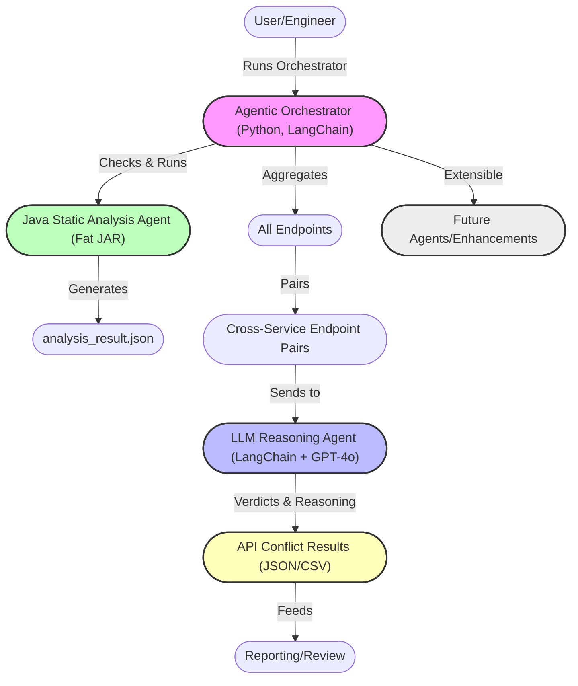

# Microservice Consolidation Platform 🚀

Welcome to the Microservice Consolidation Platform—a smart, agentic, and extensible system designed to analyze, reason about, and help merge complex microservice architectures. This project combines the best of modern Java, Python, Next.js, and AI (LangChain, GPT-4o, Claude) to automate the heavy lifting of microservice consolidation.

---

## 🌟 Project Highlights
- **Agentic Orchestration:** Fully automated pipeline using LangChain agents for static analysis, endpoint aggregation, and LLM-powered API conflict reasoning.
- **Cross-Language:** Java (Spring Boot, Gradle) for static code analysis; Python for orchestration, reasoning, and reporting; Next.js for a modern frontend.
- **AI-Driven:** Uses GPT-4o (OpenAI) and Claude (Anthropic) for deep, explainable reasoning about API compatibility and merge strategies.
- **Extensible:** Designed for easy addition of new agents, analysis modules, and reporting features.

---

## 🛠️ Setup Guide

### 1. Clone the Repository
```bash
git clone https://github.com/your-org/microservice-consolidation.git
cd microservice-consolidation
```

### 2. Frontend (Next.js)
```bash
cd microservices-consolidation
npm install
npm run dev
# Visit http://localhost:3000
```

### 3. Backend Static Analysis (Java 21, Gradle)
- Ensure you have **Java 21+** and **Gradle** installed.
- Build the fat JAR for static analysis:
```bash
cd springboot-backend
./gradlew shadowJar
```
- The analysis agent will be invoked automatically by the orchestrator (see below).

### 4. Python Compatibility Engine & Orchestrator
- Requires **Python 3.10+**
- Install dependencies:
```bash
cd compatibility-engine
pip install -r requirements.txt
```
- Set up your `.env` file with OpenAI and/or Anthropic API keys (see `.env.example`).

### 5. Taskmaster-AI (with Claude Profile)
- Used for project/task management and smart planning.
- Install globally or use via npx:
```bash
npm install -g task-master-ai
# or
npx task-master-ai init
```
- Initialize in your project root:
```bash
task-master-ai init --rules claude,cursor
```
- Parse your PRD and expand tasks:
```bash
task-master-ai parse-prd .taskmaster/docs/microservice_merger_prd.md
```
- See your tasks:
```bash
task-master-ai list
```

---

## 🤖 LangChain Agentic Orchestration Architecture



---

## ✅ Completed Tasks & Current State
- **Project bootstrapped** with Next.js frontend and Spring Boot backend (Java 21, Gradle)
- **Taskmaster-AI** set up with Claude and Cursor rules for smart planning
- **Python GitHub integration** for repo validation and metadata extraction
- **Java static analysis agent** for endpoint and config extraction, YAML parsing, and serialization
- **Compatibility engine** (Python, Typer CLI) for API conflict, dependency, and version analysis
- **Agentic orchestrator** (Python, LangChain) automates the full pipeline:
    - Builds and runs Java analysis as needed
    - Aggregates endpoints from all repos
    - Generates all cross-service endpoint pairs
    - Uses GPT-4o for LLM-powered API conflict reasoning
    - Outputs results in JSON and CSV
- **Automated JUnit and Python tests** for all major modules
- **All code and results committed and pushed**

---

## 💡 Next Steps
- Add advanced merge strategy planning (AI-powered)
- Enhance reporting and visualization
- Integrate more LLMs and agent types
- Build a beautiful dashboard in Next.js

---

## 👋 Questions or Contributions?
Open an issue, start a discussion, or submit a PR! This project is designed to be a playground for smart, agentic engineering—let’s build the future of microservice consolidation together.
